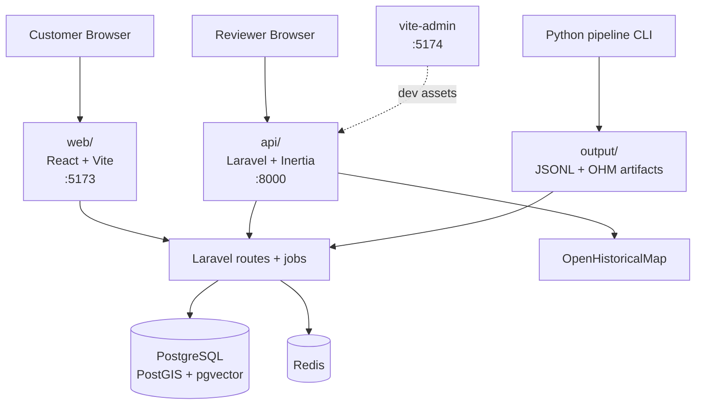

# history-mapped Architecture Overview

## System Overview

history-mapped is a monorepo with three active product and engineering surfaces:

- `api/`: the primary Laravel application, serving the REST API, auth flows, background jobs, and the Inertia-based admin/editor UI.
- `web/`: a standalone React SPA served by Vite. Today it is a thin bootstrap client wired to the Laravel health endpoint.
- `pipeline/`: a Python pipeline with three tracks — Wikidata/Wikipedia scraping, staged OpenHistoricalMap borders processing, and a **LangGraph agentic pipeline** (`pipeline/agent/`) that turns raw historical text into validated entity/relation/chronicle proposals.

The Laravel app is the richest implemented surface today. The standalone `web/` package is already connected to the backend but remains intentionally small, while the MapLibre-based historical map and geometry editing tooling currently lives in the admin code inside `api/resources/js`.

> The LangGraph agentic pipeline is an MVP: it produces artifacts and is test-covered with mocked LLMs, but its database-commit path has known critical defects (it currently writes nothing to the DB on a real run). See [implementation-docs/agentic-pipeline-runbook.md](implementation-docs/agentic-pipeline-runbook.md) and [plans/12-bug-report.md](plans/12-bug-report.md) before relying on it.

## Runtime Surfaces

| Surface / Service | Port | Responsibility | Current state |
|-------------------|------|----------------|---------------|
| **Laravel app / admin** | `8000` | Main application entry point, Inertia admin UI, and public API host | Primary working application surface |
| **Admin Vite HMR** | `5174` | Hot-module reload server for the admin frontend | Dev-only support service |
| **Customer web SPA** | `5173` | Standalone React client | Bootstrap client; currently checks `/api/v1/health` |
| **Python pipeline** | - | Wikidata/topic extraction and OHM borders processing | Host-side CLI workflow |
| **PostgreSQL** | `5432` | Primary relational, spatial, and vector store | Backed by PostGIS + pgvector |
| **Redis** | `6379` | Cache, sessions, and queue backend | Shared infra service |
| **Queue worker** | - | Laravel background jobs | Used by imports and async processing |
| **Scheduler** | - | Laravel scheduled tasks | Runs the app scheduler loop |
| **Mailpit** | `8025` | Local mail testing UI | Local development support |
| **CloudBeaver** | `8978` | Database inspection UI | Local development support |
| **RedisInsight** | `5540` | Redis inspection UI | Local development support |



## Repository Responsibilities

| Area | Main responsibility | Key contents |
|------|---------------------|--------------|
| **`api/`** | Backend application and admin/editor surface | Laravel app code, Inertia React admin, `routes/web.php`, `routes/api.php`, `routes/settings.php`, queue jobs, models, actions |
| **`web/`** | Standalone customer-facing SPA | React 19 + Vite app, TanStack Query, Axios, `src/pages/home.tsx`, `src/lib/api.ts` |
| **`pipeline/`** | Offline ingestion, artifact generation, and agentic extraction | `wikidata/`, `ohm_borders/`, `ohm_collections/`, `agent/` (LangGraph), `tests/`, `config.py`, `__main__.py` |
| **`output/`** | Generated pipeline artifacts | Topic JSONL files and `ohm_borders/<run_id>/...` stage output |
| **`docker/`** | Local container orchestration | Dockerfiles plus `docker/docker-compose.yml` |
| **`docs/`** | Architecture, runbooks, schemas, plans | Setup docs, pipeline docs, model docs, implementation plans |

## Route and Auth Model

### Route files in the repo

| File | Responsibility |
|------|----------------|
| **`api/routes/web.php`** | Welcome page, authenticated admin pages, entity screens, reference-table pages, geometry-period routes, relationship routes, Chronicle CRUD pages (`chronicles.*`) |
| **`api/routes/api.php`** | Versioned `/api/v1` JSON API: health check; public map reads (`entities/map`, `entities/map/year`, `map/resolve-ohm-feature`); entity/source/timeline/geo-reference reads; public Chronicle reads (`chronicles`, `chronicles/{slug}`); and Sanctum-protected writes |
| **`api/routes/settings.php`** | Profile, security, and appearance routes for authenticated users |
| **`api/routes/console.php`** | Console route definitions |

Laravel Fortify provides the auth endpoints; there is no separate `routes/auth.php` file in the repository.

### Authentication surfaces

| Surface | Auth strategy | Notes |
|---------|---------------|-------|
| **Admin UI** | Laravel session auth via the `web` guard | Protected by `auth` and `verified` middleware |
| **API write endpoints** | `auth:sanctum` | JSON writes under `/api/v1` require authenticated Sanctum sessions |
| **Customer SPA** | Prepared for Sanctum SPA cookie auth | Current implementation only exercises a read-only health check path |

## Map and Editor Placement

- MapLibre-based historical map rendering currently lives in the Laravel admin frontend, not the standalone `web/` package.
- Admin-side React includes the historical map viewer, geometry editor, entity history timeline, relationship editing, and geography-reference tooling.
- The standalone `web/` package is currently a minimal client shell with React Router, TanStack Query, Axios, and a single home page that checks backend availability.

## Data Pipeline and Import Flow

The ingestion architecture is file-based rather than streaming-based.

1. Python commands under `pipeline/` scrape or assemble source data. Three tracks exist: Wikidata/Wikipedia scraping (`pipeline/wikidata/`), staged OHM borders (`pipeline/ohm_borders/`, `pipeline/ohm_collections/`), and the **LangGraph agentic pipeline** (`pipeline/agent/`) that extracts entity/relation/chronicle proposals from raw historical text.
2. The pipeline writes JSONL files and staged artifacts into `output/` (the agent writes to `output/agent_runs/<run_id>/`).
3. Laravel artisan commands import those artifacts into PostgreSQL.
4. Queue jobs and follow-up commands resolve relationship hints and generate embeddings.

> **Caveat (agentic track):** the agent's commit node shells out to artisan importers but currently passes a host path the app container cannot see and never checks the return code, so on a real run it persists nothing while reporting success; chronicles are written to disk but not imported. Treat the agentic write path as not-yet-working — see [plans/11-agentic-pipeline-improvements.md](plans/11-agentic-pipeline-improvements.md).

```mermaid
flowchart LR
    Wikidata[Wikidata / Wikipedia] --> Scrape[py -m pipeline scrape | topic | dedup]
    OHM[OpenHistoricalMap / Overpass] --> Borders[py -m pipeline borders ...]
    Scrape --> Output[output/*.jsonl]
    Borders --> Output
    Output --> Import[php artisan pipeline:import*]
    Import --> DB[(entities / relationships / hints)]
    DB --> Embed[php artisan pipeline:embeddings]
```

Current Laravel-side import commands:

| Command | Purpose |
|---------|---------|
| **`pipeline:import`** | Import generic Wikidata/topic JSONL files |
| **`pipeline:import-borders`** | Import OHM country/entity JSONL output |
| **`pipeline:import-border-relations`** | Import OHM relation entities and stage relation hints |
| **`pipeline:embeddings`** | Generate or refresh pgvector embeddings |
| **`chronicles:import`** | Import agent-produced `chronicle.json` into `chronicles`/`chronicle_entries` (not yet invoked by the agent — see caveat above) |

## Local Development Topology

File: `docker/docker-compose.yml`

| Service | Port | Role |
|---------|------|------|
| **`composer-install`** | - | One-shot Composer install init container |
| **`app`** | - | PHP-FPM runtime for Laravel |
| **`nginx`** | `8000` | HTTP entry point for Laravel |
| **`pnpm-install`** | - | One-shot pnpm install init container |
| **`web`** | `5173` | Customer SPA Vite dev server |
| **`vite-admin`** | `5174` | Admin frontend HMR server |
| **`db`** | `5432` | PostgreSQL + PostGIS + pgvector |
| **`redis`** | `6379` | Cache, sessions, queues |
| **`queue`** | - | `php artisan queue:work` |
| **`scheduler`** | - | `php artisan schedule:run` loop |
| **`mailpit`** | `8025` | Local mail UI |
| **`cloudbeaver`** | `8978` | DB inspection UI |
| **`redisinsight`** | `5540` | Redis inspection UI |

Working conventions:

- Run PHP and Node commands through Docker for the Laravel and Vite surfaces.
- Use `pnpm` at the repo root for workspace-level scripts.
- Run `py -m pipeline ...` from the repo root after activating `pipeline/.venv`.

## Architecture Summary

| Area | Current choice | Why it exists |
|------|----------------|---------------|
| **Backend framework** | Laravel 13 | Unifies admin delivery, API routing, queues, auth, and editorial workflows |
| **Admin frontend** | Inertia.js + React inside Laravel | Keeps the most advanced editing and mapping tools close to the backend |
| **Customer frontend** | React + Vite SPA | Separate browser client for future public-facing experiences |
| **Map stack** | MapLibre GL JS + OpenHistoricalMap | Powers historical map rendering and geometry editing in the admin surface |
| **Data pipeline** | Python CLI + JSONL artifacts | Supports repeatable offline scrape/import workflows |
| **Primary data store** | PostgreSQL 16 + PostGIS + pgvector | Handles relational, spatial, temporal, and semantic queries |
| **Local environment** | Docker Compose + host Python venv | Keeps app runtime containerized while leaving the Python pipeline ergonomic to run locally |

---

## Related Documents

| Document | Description |
|----------|-------------|
| `README.md` | Foundational architecture for the Historical Atlas platform, including the three-layer map model and AI-to-human review lifecycle |
| `docs/implementation-docs/setup.md` | Monorepo setup, workspace structure, Docker services, auth model, and contract generation flow |
| `docs/implementation-docs/entity_specification.md` | Entity types, enums, and field-level data model details |
| `docs/implementation-docs/reference_tables.md` | Historical periods, regions, and supporting reference data |
| `docs/entity-model/` | Canonical entity/relationship/chronicle data model reference |
| `docs/implementation-docs/agentic-pipeline-runbook.md` | LangGraph agentic pipeline node reference and run instructions |
| `docs/implementation-docs/data_pipeline_architecture.md` | All three pipeline tracks and the Laravel import layer |
| `docs/plans/10-map-query-optimization.md` | Map bbox query optimization plan (headline) |
| `docs/plans/11-agentic-pipeline-improvements.md` | Agentic pipeline reliability/idempotency/observability plan |
| `docs/plans/12-bug-report.md` | Consolidated, severity-ranked audit bug report |
| `docs/reference/implementation-docs/game_inspired_ui_ux.md` | Design reference for the intended historical atlas frontend UI direction |
