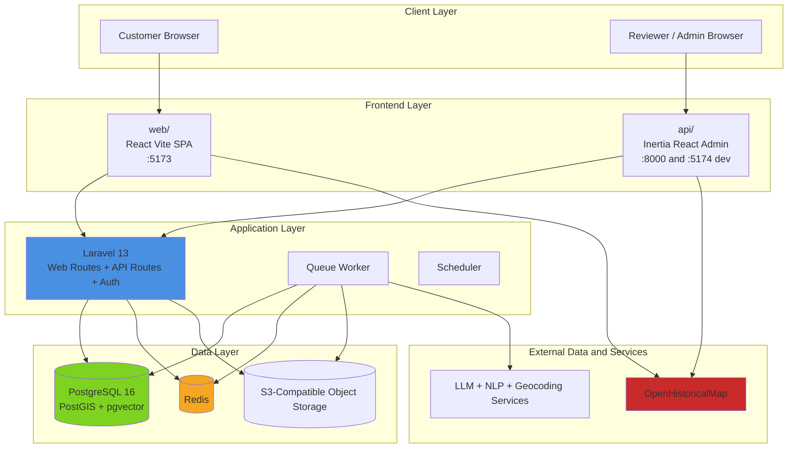
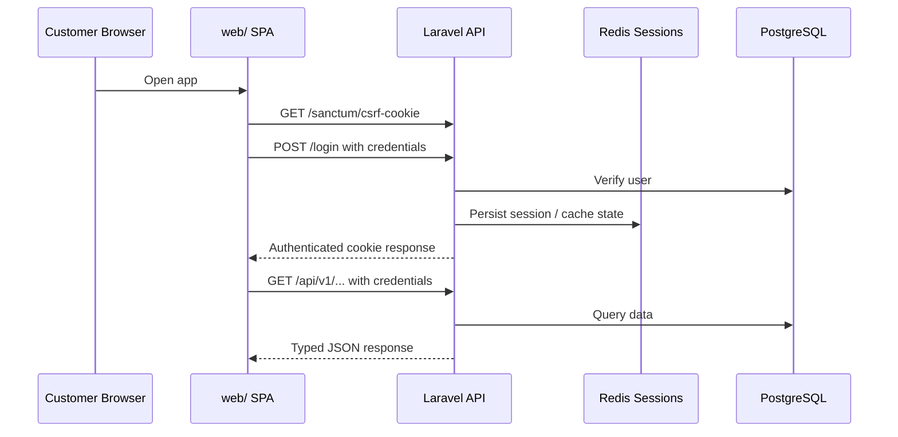
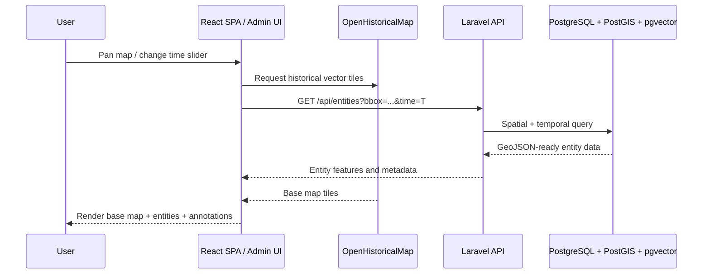
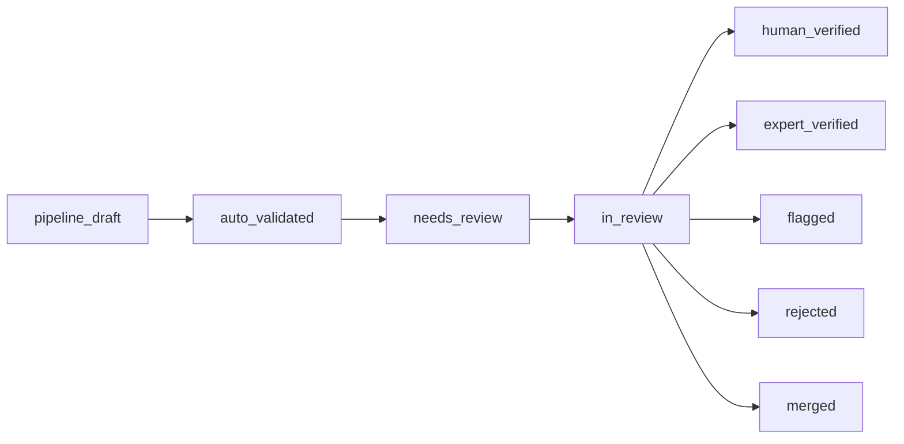

# WikiGlobe Architecture Overview

## System Overview

WikiGlobe is the implementation monorepo for the Historical Atlas platform described in `README.md`. The platform combines a time-aware historical map, a structured historical entity database, and editorial workflows for AI-assisted data generation with human verification.

At a high level, the architecture blends two views of the system:

- A **historical mapping platform** built around OpenHistoricalMap, temporal-spatial entity data, and annotation layers.
- A **developer-facing monorepo** built with Laravel, React, TypeScript workspaces, PostgreSQL, Redis, and Docker Compose.

## Platform Overview

### Product Architecture Layers

| Layer | Purpose | Primary Technology | Source of Truth |
|-------|---------|--------------------|-----------------|
| **1. Historical Base Map** | Period-accurate geography, borders, cities, roads, rivers, and terrain | OpenHistoricalMap + MapLibre GL JS | OHM vector tiles and temporal metadata |
| **2. Historical Entity Platform** | Historical entities, relationships, search, review, and temporal map overlays | Laravel + PostgreSQL 16 + PostGIS + pgvector | AI-generated data refined by human review |
| **3. Annotation and Editorial Layer** | Beziers, labels, arrows, freeform polygons, and analytical overlays | React tooling + PostGIS-backed geometry | User and editor-created content |

### Monorepo Components

| Workspace / Service | Port | Description |
|---------------------|------|-------------|
| **`api/`** | `8000` | Laravel 13 application that serves the REST API, authentication flows, admin routes, and the Inertia React admin panel |
| **`web/`** | `5173` | Customer-facing React SPA (stub — not yet connected to the API) |
| **`vite-admin`** | `5174` | Dedicated Vite dev server for the Inertia admin frontend during local development |
| **`db`** | `5432` | PostgreSQL 16 as the primary database, extended by the platform architecture with PostGIS and pgvector |
| **`redis`** | `6379` | Cache, sessions, queues, and rate limiting |
| **`queue`** | - | Laravel queue worker for background jobs and pipeline-style processing |
| **`scheduler`** | - | Laravel scheduler loop for recurring jobs |
| **`mailpit`** | `8025` | Local email testing interface |
| **OpenHistoricalMap** | external | Historical vector tile provider used as the temporal base map |
| **S3-compatible storage** | external / self-hosted | Raw source documents, exports, backups, and large artifacts |

---

## 1. High-Level System Architecture

---

## 2. Repository and Runtime Responsibilities

| Area | Main Responsibility | Key Contents |
|------|---------------------|--------------|
| **`api/`** | Backend application and admin surface | Laravel app code, Inertia React admin, `routes/web.php`, `routes/api.php`, `routes/auth.php` |
| **`web/`** | Customer-facing application (stub) | React SPA scaffold — not yet connected to the API |
| **`docker/`** | Local container orchestration | Dockerfiles for API, web, admin Vite, plus `docker/docker-compose.yml` |
| **Root workspace** | Tooling and orchestration | `pnpm-workspace.yaml`, root `package.json`, Docker helper scripts, root `.env.example` |

### Route and Surface Split

| Surface | Access Pattern | Notes |
|---------|----------------|-------|
| **Admin UI** | Laravel web routes (bare paths, no `/admin` prefix) | Inertia React app rendered inside Laravel, protected by `auth` and `verified` middleware |
| **Public API** | Versioned Laravel API under `/api/v1` | Consumed by the customer SPA and future API-first consumers |
| **Auth endpoints** | Shared Laravel auth routes via Fortify | Customer SPA uses cookie-based auth; admin uses Laravel session auth |

---

## 3. Authentication and Authorization Model

| Surface | Auth Strategy | Authorization Model |
|---------|---------------|---------------------|
| **Admin** | Laravel session auth with the `web` guard (via Fortify) | `spatie/laravel-permission` roles and permissions; admin routes protected by `auth` and `verified` middleware |
| **Customer SPA** | Laravel Sanctum SPA cookie auth | First-party browser auth using `withCredentials: true` and `/sanctum/csrf-cookie` before login |
| **Future third-party or mobile clients** | Not part of v1 | The setup guide recommends adding a dedicated OAuth2/OIDC strategy later rather than overloading SPA auth |

---

## 4. Historical Map and Data Flow

The platform is designed around a temporal map experience where geography, entities, and annotations all respond to the selected time period.

### Core Map Request Flow

### Core Query Pattern

The foundational map query described in `README.md` is:

- filter entities by **bounding box**
- filter entities by **time range overlap**
- filter entities by **verification status**
- return geometry as **GeoJSON** for rendering

This is why the target data layer combines PostgreSQL with **PostGIS** for spatial querying and **pgvector** for semantic search and similarity.

---

## 5. AI-to-Human Verification Lifecycle

The architecture assumes AI-assisted entity generation, but human review is the quality gate before public display.

| Status | Meaning | Visibility |
|--------|---------|------------|
| **`pipeline_draft`** | Pipeline-created entity that is not yet validated | Reviewers only |
| **`auto_validated`** | Passed automated checks and is waiting for review | Reviewers only |
| **`needs_review`** | In the review queue | Reviewers only |
| **`in_review`** | Claimed by a reviewer | Assigned reviewer and admins |
| **`human_verified`** | Approved and visible in the normal product experience | All users |
| **`expert_verified`** | Approved by a domain expert | All users |
| **`flagged`** | Visible but under re-examination | All users |
| **`rejected`** / **`merged`** | Removed from normal display, retained for audit purposes | Admin-only audit context |

---

## 6. Local Development Topology

File: `docker/docker-compose.yml`

| Service | Port | Role | Notes |
|---------|------|------|-------|
| **`app`** | - | PHP 8.4-FPM Laravel runtime | Runs PHP, Composer, and Artisan tasks |
| **`nginx`** | `8000` | Local HTTP entrypoint for Laravel | Public local backend URL |
| **`web`** | `5173` | Customer Vite dev server | Customer SPA development |
| **`vite-admin`** | `5174` | Inertia admin Vite dev server | Admin frontend HMR |
| **`db`** | `5432` | PostgreSQL database | Primary relational store |
| **`redis`** | `6379` | Cache, session, and queue backend | Shared infra service |
| **`queue`** | - | Background worker | Runs `php artisan queue:work` |
| **`scheduler`** | - | Scheduled job runner | Laravel scheduler loop |
| **`mailpit`** | `8025` | Local mail UI | Email testing |
| **`cloudbeaver`** | `8978` | Web DB admin UI | CloudBeaver for database inspection |
| **`redisinsight`** | `5540` | Redis inspection UI | RedisInsight |

### Communication Patterns

- Browser traffic uses published localhost ports: `8000`, `5173`, and `5174`.
- Containers communicate internally by service name such as `db`, `redis`, `app`, and `nginx`.
- Source code is bind-mounted into app containers, while dependency directories live in Docker volumes for consistency.
- Day-to-day development is intended to run entirely inside containers rather than through host-installed PHP, Composer, Node, or pnpm.

---

## 7. Deployment Model

| Deployment Unit | Model |
|-----------------|-------|
| **Laravel application** | Build one application image and run it as the web app, queue worker, and scheduler |
| **Customer frontend** | Deploy `web/` separately as static assets behind a CDN |
| **Database** | Start with PostgreSQL locally; move to managed PostgreSQL with PostGIS and pgvector as scale grows |
| **Cache / sessions / queues** | Redis locally, then dedicated managed Redis in production |
| **Object storage** | MinIO locally or S3-compatible storage such as AWS S3 or Cloudflare R2 |
| **Historical base map** | Consume OHM tiles directly from OpenHistoricalMap infrastructure |

---

## 8. Architecture Summary Table

| Area | Primary Choice | Why It Exists |
|------|----------------|---------------|
| **Backend framework** | Laravel 13 | Unifies admin delivery, auth, API routing, queues, and review workflows |
| **Admin UI** | Inertia.js + React inside Laravel | Keeps editorial and review tools close to server-rendered workflows |
| **Customer UI** | React + Vite SPA | Supports rich interactive browsing, search, and map experiences |
| **Map stack** | MapLibre GL JS + OpenHistoricalMap | Enables time-aware historical map rendering without vendor lock-in |
| **Primary data store** | PostgreSQL 16 + PostGIS + pgvector | Supports relational, spatial, temporal, and semantic queries in one system |
| **Background processing** | Laravel queues + scheduler | Handles async work, imports, review support, and recurring jobs |
| **Local environment** | Docker Compose | Standardizes PHP, Node, Vite, Postgres, Redis, and supporting services |

---

## Related Documents

| Document | Description |
|----------|-------------|
| `README.md` | Foundational architecture for the Historical Atlas platform, including the three-layer map model and AI-to-human review lifecycle |
| `docs/implementation-docs/setup.md` | Monorepo setup, workspace structure, Docker services, auth model, and contract generation flow |
| `docs/implementation-docs/entity_specification.md` | Entity types, enums, and field-level data model details |
| `docs/implementation-docs/reference_tables.md` | Historical periods, regions, and supporting reference data |
| `docs/implementation-docs/game_inspired_ui_ux.md` | UI direction for the historical atlas frontend |
