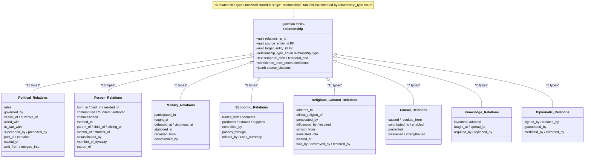
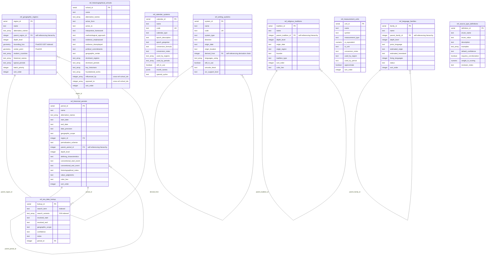

# Entity Model — UML Diagrams

Visual diagrams for the WikiGlobe data model. All diagrams use Mermaid syntax.

---

## 1. Core Domain ERD — Entities, Relationships & Sources

The main domain tables: single-table-inheritance `entities`, the `relationships` junction table (76 typed edges), `sources`, and `users` with RBAC.

```mermaid
erDiagram
    users {
        bigint id PK
        text name
        text email UK
        timestamp email_verified_at
        text password
        text two_factor_secret
        text two_factor_recovery_codes
        timestamp two_factor_confirmed_at
    }

    entities {
        uuid entity_id PK
        entity_type_enum entity_type "NOT NULL — 30 types (STI discriminator)"
        entity_group_enum entity_group "NOT NULL — POLITY | PLACE | EVENT | ECONOMY | CULTURE"
        text name "full-text indexed"
        text_array alternative_names
        text wikidata_id
        uuid primary_geo_ref_id FK "nullable — active canonical georef"
        geometry geom "PostGIS GIST indexed"
        geometry territory_geom "PostGIS GIST indexed"
        text location_name
        text temporal_start
        text temporal_end
        integer temporal_start_year "derived — indexed"
        integer temporal_end_year "derived — indexed"
        duration_type_enum duration_type
        text date_raw
        date_resolution_method_enum date_method
        confidence_level_enum date_confidence
        confidence_level_enum location_confidence
        location_resolution_method_enum location_method
        text summary
        text significance
        jsonb attributes "type-specific fields — GIN indexed"
        integer impact_score
        integer display_priority
        icon_class_enum icon_class
        text entity_color
        text era_label
        text temporal_display_range
        text_array tags "GIN indexed"
        verification_status_enum verification_status "NOT NULL — default pipeline_draft"
        confidence_level_enum confidence
        text confidence_notes
        jsonb confidence_breakdown
        jsonb source_citations "GIN indexed"
        jsonb media_refs
        integer source_diversity_score
        text_array validation_flags
        jsonb relationship_summary
        integer nearby_entity_count
        integer cluster_id
        vector_1536 embedding "HNSW indexed"
        text embedding_version
        uuid parent_entity_id FK
        uuid successor_entity_id FK
        bigint reviewer_id FK
        timestamp review_date
        text created_by
        timestamp created_at
        timestamp updated_at
    }

    relationships {
        uuid relationship_id PK
        uuid source_entity_id FK "NOT NULL — cascade delete"
        uuid target_entity_id FK "NOT NULL — cascade delete"
        relationship_type_enum relationship_type "NOT NULL — 76 types"
        text temporal_start
        text temporal_end
        text description
        confidence_level_enum confidence
        jsonb source_citations
        timestamp created_at
        text created_by
    }

    sources {
        uuid source_id PK
        text title "full-text indexed"
        reliability_tier_enum source_type "NOT NULL"
        text document_type
        text author
        text date_created
        text date_discovered
        text language
        text current_location
        text source_url
        text content_hash UK
        timestamp ingestion_date
        text geographic_scope
        text temporal_scope
        text contemporaneity
        text author_bias
        text corroboration
        text scholarly_consensus
        text raw_file_path
        text nlp_output_path
        text llm_log_path
        timestamp created_at
        timestamp updated_at
    }

    geometry_snapshots {
        uuid snapshot_id PK
        uuid entity_id FK "NOT NULL — cascade delete"
        integer year_start "NOT NULL"
        integer year_end "NOT NULL"
        geometry geom "PostGIS — point or linestring"
        geometry territory_geom "PostGIS — polygon"
        text label "short display title"
        text description "why this geometry exists"
        confidence_level_enum confidence
        jsonb source_citations
        text notes "editorial"
        integer display_priority
        uuid geo_ref_id FK "optional — external geo ref (OHM/other source)"
        uuid source_event_id FK "optional — event that changed territory"
        uuid relationship_id FK "optional — relationship that placed entity here (CASCADE)"
        text created_by
        timestamp created_at
        timestamp updated_at
    }

    entity_geo_refs {
        uuid geo_ref_id PK
        uuid entity_id FK "NOT NULL — cascade delete"
        text provider "ohm | wikidata | geonames | pleiades | custom"
        text external_type "node | way | relation | feature | qid"
        text external_id "e.g. relation/2744968 or Q16553"
        text match_role "primary | candidate | fallback | rejected"
        text retrieval_method "overpass | nominatim | rest | manual"
        text temporal_start
        text temporal_end
        integer temporal_start_year "normalized for filtering"
        integer temporal_end_year "normalized for filtering"
        jsonb external_tags "raw OSM/OHM tags or external metadata"
        jsonb source_meta "query, endpoint, attribution, license"
        numeric match_score
        boolean is_active
        timestamp last_verified_at
        timestamp created_at
        timestamp updated_at
    }

    roles {
        bigint id PK
        text name
        text guard_name
    }

    permissions {
        bigint id PK
        text name
        text guard_name
    }

    entities ||--o{ entities : "parent_entity_id (hierarchy)"
    entities ||--o| entities : "successor_entity_id (succession)"
    users ||--o{ entities : "reviewer_id (reviews)"
    entities ||--o{ relationships : "source_entity_id"
    entities ||--o{ relationships : "target_entity_id"
    entities ||--o{ geometry_snapshots : "entity_id (temporal geometries)"
    entities ||--o{ entity_geo_refs : "entity_id (external geo links)"
    entity_geo_refs ||--o| entities : "primary_geo_ref_id (canonical link)"
    entity_geo_refs ||--o{ geometry_snapshots : "geo_ref_id (geometry provenance)"
    entities ||--o{ geometry_snapshots : "source_event_id (territory change cause)"
    relationships ||--o{ geometry_snapshots : "relationship_id (presence cause — CASCADE)"
    users }o--o{ roles : "model_has_roles"
    users }o--o{ permissions : "model_has_permissions"
    roles }o--o{ permissions : "role_has_permissions"
```



### Key points

- **`entities`** uses single-table inheritance — `entity_type` (30 values) discriminates the type, `entity_group` groups them into 5 families
- **`relationships`** is a many-to-many junction between entities with a typed edge (`relationship_type` — 76 values)
- **`sources`** is referenced from `entities.source_citations` (JSONB array of `{ source_id, page, quote }`)
- **Self-referencing FKs** on `entities`: `parent_entity_id` (tree hierarchy) and `successor_entity_id` (temporal succession chain)
- **`geometry_snapshots`** stores time-varying geometries per entity (empire borders, person presence at events). The `description` field explains *why* the geometry exists. Two optional provenance FKs: `relationship_id` (CASCADE — for presence snapshots derived from a specific relationship like `signed_by`) and `source_event_id` (SET NULL — for territory changes caused by events)
- **`entity_geo_refs`** stores canonical links to external geospatial systems (especially OHM/OSM), including typed element IDs (`node|way|relation`) and raw tag snapshots used at match time
- **`entities.primary_geo_ref_id`** points to the canonical active georef row, so an entity always has one default external anchor when available
- **Geometry provenance chain**: `geometry_snapshots.geo_ref_id` points to the exact external reference that produced the geometry, so map interactions can open the underlying OHM feature or fallback source
- **PostGIS columns**: `geom` (point/polygon/linestring), `territory_geom` (nullable polygon extent)
- **pgvector column**: `embedding` (1536-dim, HNSW indexed) for semantic search

### 1.1 OHM Under the Hood (OSM-Compatible Data Model)

OpenHistoricalMap uses the OSM element model:

- **Node** — point geometry
- **Way** — ordered nodes (line or closed polygon)
- **Relation** — grouped members (critical for boundaries and chronology)
- **Tags** — key/value metadata attached to any element

For historical entities, the most important relation type is `type=chronology`, which links multiple dated stages of the same real-world feature. In practice, your map integration should prefer chronology relations when available, then fall back to stage members.

### 1.2 Geo Resolution Pipeline (Wikidata → OHM → Fallback → Empty)

```mermaid
flowchart TD
    A[Extract entity from Wikidata] --> B{Has geo clue?\ncoords / place / boundary / QID}
    B -- no --> Z[Store entity with empty geom\nlocation_confidence=unresolved]
    B -- yes --> C[Try OHM resolution\nNominatim + Overpass + relation lookup]
    C --> D{Matched OHM element?}
    D -- yes --> E[Create entity_geo_refs row\nprovider=ohm, external_type=node|way|relation]
    E --> F[Hydrate geom/territory_geom\nfrom OHM element geometry]
    F --> G[Optional: add geometry_snapshots\nwith geo_ref_id provenance]
    D -- no --> H[Try fallback border/geometry providers\n(custom datasets, manual digitizing)]
    H --> I{Fallback geometry found?}
    I -- yes --> J[Create entity_geo_refs row\nprovider=custom or source name]
    J --> K[Hydrate geom/territory_geom\nmark location_method=source_database|human_assigned]
    I -- no --> Z
```

Implementation note: `entity_geo_refs.match_role` should mark only one active `primary` record per entity, while keeping historical `candidate`/`rejected` rows for auditability.

### 1.3 Click Flow: OHM Feature -> WikiGlobe Entity

When the user clicks a feature on the OHM-based map (example: Rome), the app should resolve like this:

1. **Map click payload** yields external feature identity, e.g. `provider=ohm`, `external_type=relation`, `external_id=2704719`, plus active date (or date range).
2. **Reverse lookup** in `entity_geo_refs` by `(provider, external_type, external_id)` and `is_active=true`.
3. **Temporal filter** by requested date against `entity_geo_refs.temporal_start/end` (if set).
4. **Entity fetch** using `entity_id` from the matched row.
5. **Geometry selection for date**:
    - prefer `geometry_snapshots` row whose year range contains the requested date
    - fall back to base `entities.geom` / `entities.territory_geom` if no snapshot matches
6. **UI open** entity detail panel for that entity.

This makes the lookup deterministic even when multiple snapshots exist across time.

### 1.4 SQL Snippet (Click Resolution)

```sql
-- Inputs from map click context:
--   :provider='ohm', :external_type, :external_id, :target_year
WITH ref_match AS (
    SELECT r.entity_id, r.geo_ref_id
    FROM entity_geo_refs r
    WHERE r.provider = :provider
        AND r.external_type = :external_type
        AND r.external_id = :external_id
        AND r.is_active = true
        AND (r.temporal_start_year IS NULL OR r.temporal_start_year <= :target_year)
        AND (r.temporal_end_year   IS NULL OR r.temporal_end_year   >= :target_year)
    ORDER BY CASE WHEN r.match_role = 'primary' THEN 0 ELSE 1 END,
                     r.match_score DESC NULLS LAST
    LIMIT 1
),
snap AS (
    SELECT s.*
    FROM geometry_snapshots s
    JOIN ref_match rm ON rm.entity_id = s.entity_id
    WHERE s.year_start <= :target_year
        AND s.year_end   >= :target_year
    ORDER BY s.display_priority DESC NULLS LAST, s.updated_at DESC
    LIMIT 1
)
SELECT
    e.entity_id,
    e.name,
    e.entity_type,
    COALESCE(s.geom, e.geom) AS resolved_geom,
    COALESCE(s.territory_geom, e.territory_geom) AS resolved_territory_geom,
    rm.geo_ref_id
FROM ref_match rm
JOIN entities e ON e.entity_id = rm.entity_id
LEFT JOIN snap s ON true;
```

---

## 2. Entity Type Hierarchy — 5 Groups, 30 Types

All 30 entity types stored in one `entities` table via STI. The `attributes` JSONB column holds type-specific fields.

```mermaid
classDiagram
    class Entity {
        <<STI>>
        +uuid entity_id
        +entity_type_enum entity_type
        +entity_group_enum entity_group
        +text name
        +jsonb attributes
        +geometry geom
        +text temporal_start / temporal_end
    }

    class POLITY_Group {
        <<entity_group>>
    }
    class PLACE_Group {
        <<entity_group>>
    }
    class EVENT_Group {
        <<entity_group>>
    }
    class ECONOMY_Group {
        <<entity_group>>
    }
    class CULTURE_Group {
        <<entity_group>>
    }

    class political_entity {
        government_form, ruling_dynasty
        population_estimate, capital_city_name
        official_language, official_religion
        predecessor_state, successor_state
        vassals, suzerain
    }
    class dynasty {
        founding_member, ethnicity
        seat_of_power, noble_house_rank
        dynasty_origin_myth
    }
    class person {
        birth_date, death_date
        birth_place, death_place
        roles, titles, ethnicity
        cause_of_death, burial_place
    }
    class military_unit {
        unit_type, parent_force
        strength_peak, weapons
        tactics, notable_commanders
    }
    class diplomatic_relationship {
        parties, relationship_subtype
        treaty_name, terms, guarantors
    }
    class social_class {
        class_label, political_entity_context
        population_share, legal_rights
        economic_role, mobility_rules
    }

    class city {
        city_type, population_peak
        elevation_m, water_source
        fortification_type, notable_structures
    }
    class infrastructure_monument {
        structure_type, builder
        material, height_m, length_m
        engineering_innovation
    }
    class extraction_infra {
        resource_type, extraction_method
        output_peak, workforce_size
        controlling_polity
    }
    class educational_institution {
        institution_type, founded_by
        curriculum, notable_scholars
        languages_of_instruction
    }

    class event_war {
        belligerents, casus_belli
        outcome, casualties_estimate
        theaters, peace_treaty
    }
    class event_battle {
        war_context, belligerents
        commanders, forces_size
        outcome, tactical_significance
    }
    class event_treaty {
        signatories, terms
        territory_changes, guarantors
        duration, violated_by
    }
    class event_rebellion {
        rebel_leader, rebel_group
        grievances, outcome
        suppression_method
    }
    class event_natural_disaster {
        disaster_type, magnitude
        affected_area, death_toll
        long_term_impact
    }
    class event_tech_adoption {
        technology, adopted_from
        adoption_vector, impact_sector
    }
    class event_legal_reform {
        reform_type, enacted_by
        previous_law, new_law
        affected_population
    }
    class migration {
        migrating_group, origin_region
        destination_region, cause
        population_size, route_description
    }
    class epidemic_disease {
        disease_name, pathogen_type
        origin_region, mortality_rate
        affected_population, spread_vector
    }

    class trade_route {
        route_type, origin_terminus
        destination_terminus, major_waypoints
        goods_traded, active_period_detail
    }
    class natural_resource {
        resource_category, specific_resource
        abundance_level, extraction_method
        primary_use, controlling_polity
    }
    class currency_monetary_system {
        currency_name, issuing_authority
        metal_composition, denomination
        exchange_rate_notes
    }

    class cultural_work {
        work_type, creator
        language, patron
        genre, surviving_copies
    }
    class intellectual_movement {
        movement_type, key_figures
        core_tenets, origin_place
        influenced_movements
    }
    class archaeological_culture {
        defining_artifacts, material_culture
        subsistence_pattern, settlement_pattern
        burial_practice
    }
    class language {
        language_family, script
        speaker_count_peak, status
        literary_tradition
    }
    class religious_text {
        religion, original_language
        author_attribution, canon_status
        translation_history
    }
    class legal_code {
        legal_tradition, enacted_by
        predecessor_code, scope
        notable_provisions
    }
    class religious_movement {
        parent_religion, founder
        core_beliefs, practices
        schism_from, geographic_spread
    }
    class technology {
        tech_category, inventor
        prerequisites, impact
        adoption_spread
    }

    Entity <|-- POLITY_Group
    Entity <|-- PLACE_Group
    Entity <|-- EVENT_Group
    Entity <|-- ECONOMY_Group
    Entity <|-- CULTURE_Group

    POLITY_Group <|-- political_entity
    POLITY_Group <|-- dynasty
    POLITY_Group <|-- person
    POLITY_Group <|-- military_unit
    POLITY_Group <|-- diplomatic_relationship
    POLITY_Group <|-- social_class

    PLACE_Group <|-- city
    PLACE_Group <|-- infrastructure_monument
    PLACE_Group <|-- extraction_infra
    PLACE_Group <|-- educational_institution

    EVENT_Group <|-- event_war
    EVENT_Group <|-- event_battle
    EVENT_Group <|-- event_treaty
    EVENT_Group <|-- event_rebellion
    EVENT_Group <|-- event_natural_disaster
    EVENT_Group <|-- event_tech_adoption
    EVENT_Group <|-- event_legal_reform
    EVENT_Group <|-- migration
    EVENT_Group <|-- epidemic_disease

    ECONOMY_Group <|-- trade_route
    ECONOMY_Group <|-- natural_resource
    ECONOMY_Group <|-- currency_monetary_system

    CULTURE_Group <|-- cultural_work
    CULTURE_Group <|-- intellectual_movement
    CULTURE_Group <|-- archaeological_culture
    CULTURE_Group <|-- language
    CULTURE_Group <|-- religious_text
    CULTURE_Group <|-- legal_code
    CULTURE_Group <|-- religious_movement
    CULTURE_Group <|-- technology
```



### Storage note

The group/type hierarchy is **logical, not physical**. All 30 types share one `entities` table. Type-specific fields live in the `attributes` JSONB column (see [entity_specification.md, Section 4](../entity_specification.md) for the full JSONB schema per type).

---

## 3. Relationship Types — 76 Types in 8 Categories

All relationships stored in a single `relationships` table, discriminated by the `relationship_type` enum.



### Relationship directionality

Every relationship has a **source** and **target** entity. Some types imply direction (`rules`, `born_in`, `caused`) while others are symmetric (`allied_with`, `married_to`, `trades_with`). The `temporal_start`/`temporal_end` fields scope when the relationship was active.

---

## 4. Reference Tables ERD — Lookup & Classification Data

Ten reference tables providing lookup data for geographic regions, historical periods, calendars, writing systems, religious traditions, languages, and more.



### Self-referencing hierarchies

Five reference tables use self-referencing foreign keys for tree structures:

| Table | FK Column | Tree Semantics |
|-------|-----------|----------------|
| `ref_geographic_regions` | `parent_region_id` | World → Continent → Sub-region → Country |
| `ref_historical_periods` | `parent_period_id` | Era → Period → Sub-period |
| `ref_writing_systems` | `derived_from` | Proto-script → Derived scripts |
| `ref_religious_traditions` | `parent_tradition_id` | Root tradition → Denominations → Sects |
| `ref_language_families` | `parent_family_id` | Proto-family → Branch → Sub-branch |

### Cross-table FK

`ref_historical_periods.region_id` → `ref_geographic_regions` scopes periods to their geographic context (e.g., "Heian Period" → "East Asia / Japan").

`ref_era_date_lookup.period_id` → `ref_historical_periods` links search terms like "reign of Augustus" to resolved date ranges.
