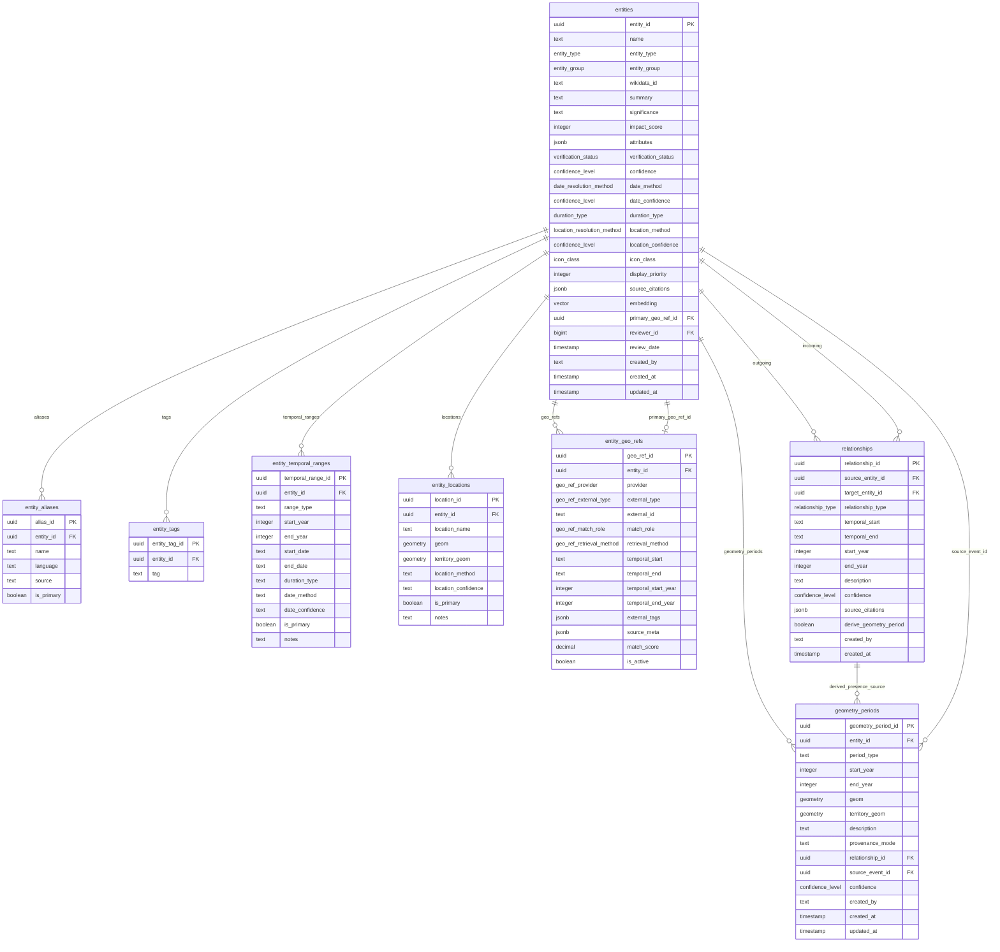
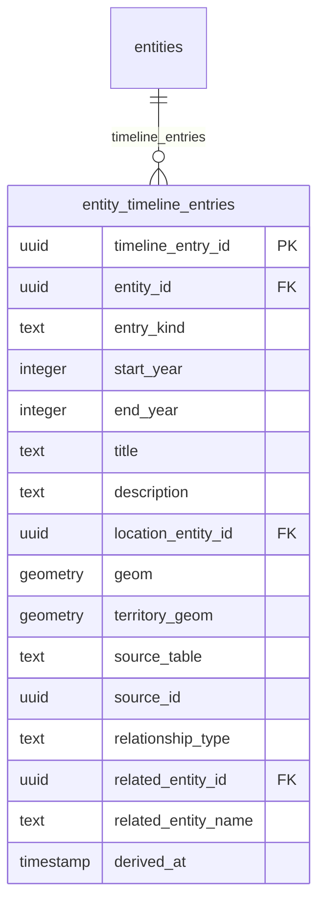
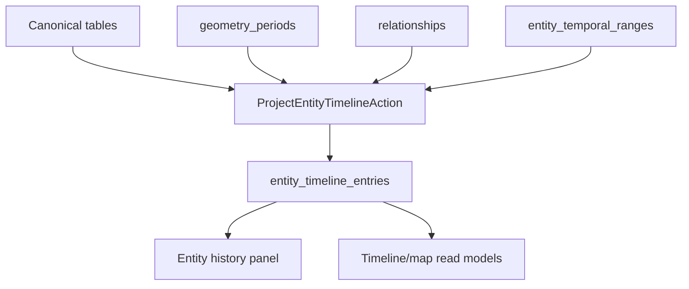
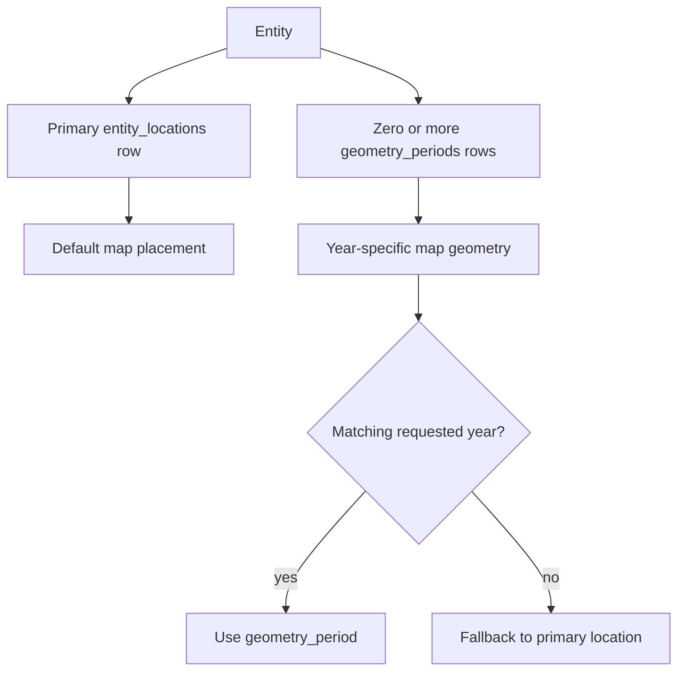
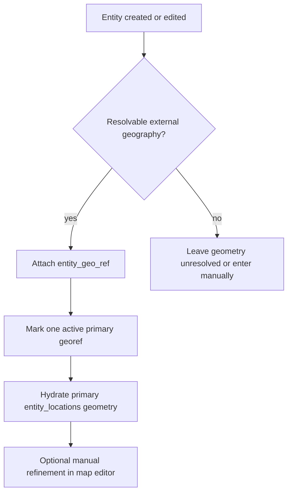
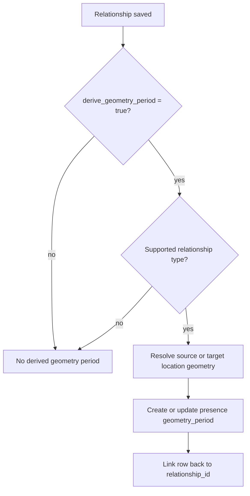
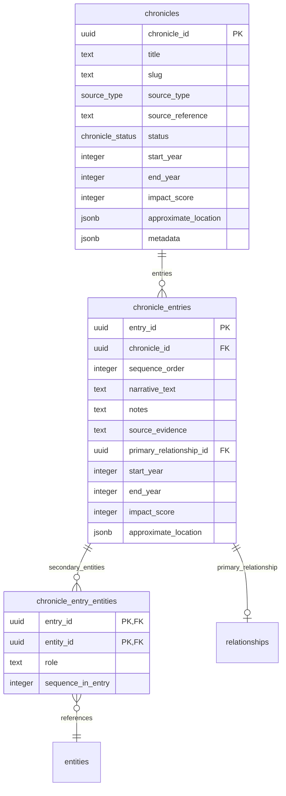

# Entity Model — Current Diagrams

> Status: current live model.
> This file replaces older diagrams that mixed historical planning material with removed columns such as direct entity-level temporal/location fields and `geometry_snapshots`.

Visual diagrams below are intentionally simplified to the live canonical structures that matter today.

---

## 1. Canonical Write Model

### Notes

- `entities` is intentionally lean compared with earlier drafts.
- Aliases, tags, dates, and base locations are normalized into their own tables.
- `geometry_periods` is the live time-varying geometry table.
- `geometry_snapshots` is not part of the current model.
- `provenance_mode` in the live database includes `manual`, `derived`, and `ohm_import`.

---

## 2. Read Model and Timeline Projection

### Projection behavior

- `geometry_periods` is the preferred source for time-scoped spatial timeline rows.
- `relationships` can contribute timeline rows even when no geometry period exists.
- `entity_temporal_ranges` is the fallback source when richer timeline inputs are absent.
- `entity_timeline_entries` is rebuildable derived data, not hand-authored truth.

---

## 3. Base Geometry vs Time-Varying Geometry

### Practical rule

- `entity_locations` answers: where is this entity by default?
- `geometry_periods` answers: where was this entity during a specific period, and why?

---

## 4. Georef Attachment Model

### Georef notes

- `entity_geo_refs` stores provider-native identifiers and match metadata.
- `entities.primary_geo_ref_id` points to the default active external anchor.
- Base geometry hydration flows into `entity_locations`, not a legacy entity-level geometry column.

---

## 5. Relationship-Derived Presence Periods

Current supported auto-presence relationship types are implemented in `CreateDerivedPresencePeriodAction`.
They currently include:

- `FoughtAt`
- `SignedBy`
- `BornIn`
- `DiedIn`
- `ResidedIn`

---

## 6. Chronicle Subsystem

Chronicles (added June 2026) are an ordered narrative layer over entities and relationships. They live in their own
tables and are not part of the `entities` row. See [attributes.md](./attributes.md) §6 for field-level detail.

### Notes

- `chronicle_entries.primary_relationship_id` is a `uuid` FK to `relationships`.
- `chronicle_entry_entities` is the many-to-many pivot (composite PK), with a `role` (default `mentioned`).
- There is no `chronicles.description` column.

---

## 7. What Changed From Older Diagrams

The following older ideas are not part of the live canonical schema and should not be copied into new docs:

- direct `alternative_names` and `tags` arrays on `entities`
- direct canonical `temporal_start`, `temporal_end`, `geom`, and `territory_geom` columns on `entities`
- `parent_entity_id` and `successor_entity_id` as active live entity columns
- `confidence_breakdown`, `relationship_summary`, `nearby_entity_count`, `cluster_id`, and `embedding_version`
- `geometry_snapshots`

If a payload still exposes helper names like `temporal_start`, `location_name`, or `geojson`, treat those as controller-level conveniences backed by normalized tables.
