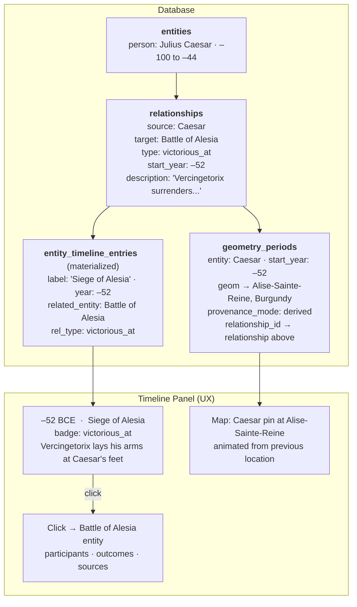
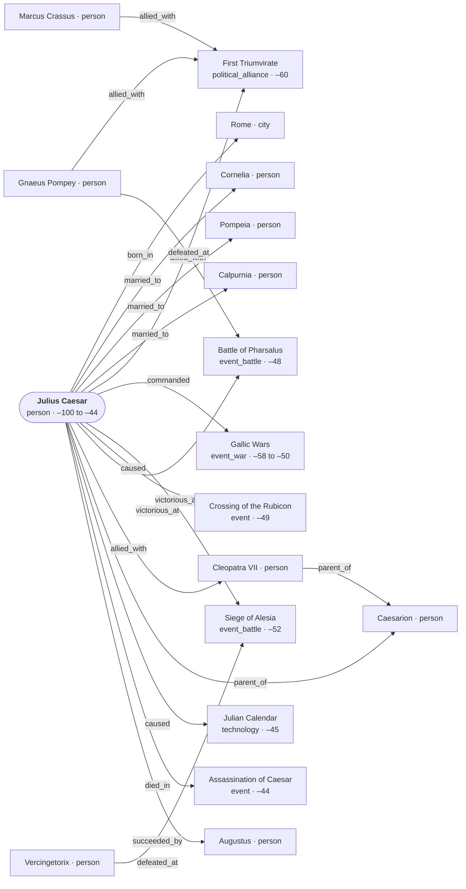

# The Entity Model — A Guide for Historians

This document explains how historical knowledge is structured in this database. No technical background is needed. If you can write a footnote or a dictionary entry, you already think in the right way.

---

## The Core Idea: Everything is an Entity

## Migration Note (Entity Model V2)

The platform now uses normalized v2 tables (`entity_temporal_ranges`, `entity_locations`, `entity_aliases`, `entity_tags`) and derived timeline entries as canonical storage. Legacy per-entity temporal/location/geometry columns were removed.

History is full of things that existed in time and space and that mattered. We call all of them **entities**. An entity can be:

- A **state** — the Achaemenid Empire, the Venetian Republic, the Qing dynasty
- A **person** — Cleopatra VII, Ibn Battuta, Tokugawa Ieyasu
- A **city** — Carthage, Samarkand, Tenochtitlan
- A **battle or war** — the Battle of Gaugamela, the Thirty Years' War
- A **migration** — the Bantu expansion, the Great Migration of the 20th century
- A **trade route** — the Silk Road, the trans-Saharan gold–salt route
- A **religious movement** — the Protestant Reformation, Mahayana Buddhism
- A **plague** — the Black Death, the Antonine Plague
- A **legal code** — the Code of Hammurabi, Justinian's *Corpus Juris Civilis*
- A **technology** — the stirrup, the printing press, iron-smelting

If it has a name, existed in a place and time, and influenced something else, it belongs here.

---

## The Five Groups

Every entity belongs to one of five broad groups. Think of them as the major departments of a historical encyclopaedia.

### POLITY — Power and People
Political entities, rulers, dynasties, armies, social classes, and formal agreements between powers.

*Examples:* Macedonian Empire, Julius Caesar, the Janissaries, the aristocracy of Han China, the Treaty of Westphalia

### PLACE — Where History Happened
Cities, ports, fortresses, monuments, mines, universities — the physical stages of history.

*Examples:* Alexandria, the Grand Canal of China, the Library of Nalanda, the salt mines of Wieliczka

### EVENT — What Happened
Wars, battles, treaties, rebellions, natural disasters, technological adoptions, legal reforms, migrations, epidemics.

*Examples:* the Mongol invasion of Khwarezm, the Plague of Justinian, the Meiji Restoration, the expulsion of Jews from Spain in 1492

### ECONOMY — How Wealth Moved
Trade routes, natural resources, currencies, and monetary systems.

*Examples:* the Silk Road, the silver mines of Potosí, Roman *denarius*, the cowrie-shell currency zone of sub-Saharan Africa

### CULTURE — Ideas, Beliefs, and Works
Intellectual movements, languages, religions, texts, legal codes, archaeological cultures, technologies.

*Examples:* the Abbasid Translation Movement, Classical Arabic, the Quran, the Justinian Code, the invention of the compass

---

## Describing an Entity

Each entity has a set of fields. Here are the ones historians care about most.

### Identity

**Name** — The primary name, usually in English or the most scholarly convention. *Carthage*, not *Qart-hadasht*, unless a case can be made.

**Alternative names** — Other names the entity is known by, including transliterations, local names, and names in other languages. *Carthage / Qart-hadasht / Cartagena (Latin)*

**Wikidata ID** — If this entity has a Wikidata page, its identifier (e.g. `Q6216`). This helps link the database to the wider web of knowledge without duplicating work.

**Summary** — A short, neutral description of one to three sentences. Think of it as the opening sentence of a good encyclopaedia entry. It should state what the entity *is*, not what it *did* (that goes in significance).

**Significance** — A longer passage explaining why this entity matters historically. This is where you can discuss causes, consequences, and interpretive debates.

**Tags** — Free-form labels for thematic searching. *e.g. `iron_age`, `mediterranean`, `collapse`, `nomadic`*

---

### Time

Dates are recorded as **years relative to the Common Era**, where negative numbers are BCE. This system avoids the ambiguities of different calendar systems.

| Field | Meaning | Example |
|---|---|---|
| `temporal_start` | When the entity began | `-264` (264 BCE — start of the First Punic War) |
| `temporal_end` | When the entity ended | `-241` (241 BCE — end of the First Punic War) |
| `date_raw` | The date as it appears in your source | *"264 to 241 BC"* |
| `temporal_display_range` | A human-readable version | *"264–241 BCE"* |
| `era_label` | A shorthand era name | *"Late Republic"*, *"Tang Dynasty"* |
| `duration_type` | Whether the entity is a point, a period, ongoing, or uncertain | `period` |

**Confidence in dates** is separate from confidence in other facts. A date can be `high` confidence (attested in multiple primary sources with year-level precision), `medium` (known within a decade), `low` (within a century), or `unresolved` (we only know the approximate era).

**How was the date determined?**  The `date_method` field records this — for instance, `source_database` (taken directly from a trusted dataset), `llm_reign_resolution` (inferred from a ruler's known reign), or `human_assigned` (a researcher made the call).

---

### Hierarchy and Succession

Entities can have a **parent** and can have **children**. This is for strict part-of or sub-unit relationships:

- The Battle of Cannae is a **child** of the Second Punic War
- The Duchy of Burgundy is a **child** of the Kingdom of France (in a given period)
- The Western Roman Empire and the Eastern Roman Empire are both **children** of the Roman Empire

The **successor** field records the entity that directly replaced this one:
- The successor of the Roman Republic is the Roman Principate
- The successor of the Umayyad Caliphate is the Abbasid Caliphate

---

### Relationships Between Entities

The richest part of the model is its **relationship system**. A relationship connects two entities with a named type and, optionally, a time window and a confidence level.

**Directed relationships** — Every relationship has a *source* and a *target*. The direction matters:

> *Julius Caesar* **[rules]** *Roman Republic*  (Caesar is the source; the Republic is the target)

This is distinct from:

> *Roman Republic* **[governed_by]** *Julius Caesar*  (the inverse — but both can be stored)

See [relationships.md](./relationships.md) for all 76 types.

---

### Geometry Periods — Where Entities Were, and Why

Every entity has a location on the map. But many entities moved, expanded, or appeared at places they are not normally associated with. The **geometry periods** system records these time-bound locations.

A geometry period answers: **"Where was this entity during this period, and why?"**

#### What a geometry period records

| Field | Meaning | Example |
|---|---|---|
| **Location** | A point, line, or polygon on the map | Münster, or the borders of the Western Roman Empire |
| **Year range** | When this location was valid | 1648–1648, or 395–476 |
| **Label** | A short title for the map | "At Münster" |
| **Description** | Why the entity was there | "Present as French representative for the signing of the Treaty of Westphalia" |
| **Confidence** | How certain we are | `high`, `medium`, `low` |

#### Two kinds of geometry period

**Presence periods** — A person or group was *at a place* because of a specific relationship. These are tied to the relationship that put them there.

> Cardinal Mazarin was in Münster in 1648 *because* he signed the Treaty of Westphalia. If we later determine that Mazarin did not actually attend the signing, we remove the `signed_by` relationship and the derived presence period disappears automatically.

**Territory periods** — A state's borders changed because of an event. These are tied to the event that caused the change.

> The Roman Empire's borders contracted after 395 CE *because* of the division under Theodosius I. Even if we delete the event entity for that division, the territory period survives — we still know what the borders looked like.

#### How you create geometry periods in the application

You do not usually create geometry periods in isolation. They are produced as a natural side effect of the relationships you build.

**From the event page (most common):**

1. You open the **Peace of Westphalia** entity
2. You add a `signed_by` relationship pointing to **Cardinal Mazarin**
3. The system asks: *"Create a derived presence period for Cardinal Mazarin at this location?"*
4. You fill in the description: *"Present as French representative for the signing"*
5. The system creates the derived period — Mazarin now appears on the map at Münster in 1648

You can repeat this for every signatory. Each gets their own derived period with its own description.

**From the referenced entity page:**

If you open **Cardinal Mazarin**'s entity page, you will see all his geometry periods listed — every place he appeared on the map and why. Each period links back to the relationship (and therefore the event) that put him there. You can edit the description or adjust the dates from either side.

**Manually (for territory changes):**

For empire borders, you draw the polygon directly on the map for a given year range and write a description explaining the change. These are not tied to a single relationship — they are tied to an event (a conquest, a treaty, a division).

#### When geometry periods are useful

| Situation | What you do |
|---|---|
| A treaty was signed at a specific location | Add `signed_by` relationships -> system offers derived presence periods for each signatory |
| A battle involved specific commanders | Add `fought_at` or `commanded` relationships -> derived periods for commanders at the battle site |
| A person founded a city | Add `founded` relationship -> derived period for the founder at the city |
| A person was born or died somewhere | Add `born_in` / `died_in` relationship -> derived period at the city |
| An empire's borders changed over centuries | Draw territory polygons for each period on the map |
| A trade route shifted over time | Draw the route's path for different eras |

#### What this looks like on the map

When a user moves the time slider to **1648**, Cardinal Mazarin appears at Münster — even though his "home" location might be Paris. The map tooltip shows: *"At Münster — Present as French representative for the signing of the Treaty of Westphalia"*. Clicking through takes the user to the Treaty of Westphalia entity.

For an empire like Rome, moving the time slider shows borders expanding and contracting smoothly, with each geometry period carrying a description of what caused the change.

---

## Three Worked Historical Examples

### Example 1 — The Rise and Fall of the Han Dynasty

This example shows how a single historical arc produces a network of entities and relationships.

**Entities:**

| Name | Type | Group | Start | End |
|---|---|---|---|---|
| Han Dynasty | `political_entity` | POLITY | −206 | 220 |
| Liu Bang (Emperor Gaozu) | `person` | POLITY | −256 | −195 |
| Xiongnu Confederacy | `political_entity` | POLITY | −209 | 93 |
| Battle of Baideng | `event_battle` | EVENT | −200 | −200 |
| Silk Road | `trade_route` | ECONOMY | −130 | 1450 |
| Chang'an | `city` | PLACE | −202 | 904 |
| Confucianism (Han State Adoption) | `intellectual_movement` | CULTURE | −136 | 220 |
| Yellow Turban Rebellion | `event_rebellion` | EVENT | 184 | 205 |

**Relationships:**

```
Liu Bang        ──[founded]──────────►  Han Dynasty
Liu Bang        ──[rules]────────────►  Han Dynasty         (−206 to −195)
Han Dynasty     ──[at_war_with]──────►  Xiongnu Confederacy  (−200 to −133)
Han Dynasty     ──[fought_at]────────►  Battle of Baideng
Xiongnu         ──[victorious_at]────►  Battle of Baideng
Han Dynasty     ──[controls]─────────►  Silk Road            (−130 to 220)
Chang'an        ──[capital_of]───────►  Han Dynasty
Han Dynasty     ──[adheres_to]───────►  Confucianism (Han)   (−136 to 220)
Yellow Turban   ──[weakened]─────────►  Han Dynasty
Han Dynasty     ──[succeeded_by]─────►  Three Kingdoms Period
```

---

### Example 2 — The Mongol Conquests and the Il-Khanate

This example shows how conquest, succession, and cultural transmission work.

**Entities:**

| Name | Type | Group | Start | End |
|---|---|---|---|---|
| Mongol Empire | `political_entity` | POLITY | 1206 | 1368 |
| Genghis Khan | `person` | POLITY | 1162 | 1227 |
| Abbasid Caliphate | `political_entity` | POLITY | 750 | 1258 |
| Sack of Baghdad | `event_battle` | EVENT | 1258 | 1258 |
| Il-Khanate | `political_entity` | POLITY | 1256 | 1335 |
| Hulagu Khan | `person` | POLITY | 1217 | 1265 |
| House of Wisdom | `educational_institution` | PLACE | 830 | 1258 |
| Black Death | `epidemic_disease` | EVENT | 1346 | 1353 |

**Relationships:**

```
Genghis Khan   ──[founded]──────────►  Mongol Empire
Hulagu Khan    ──[member_of_dynasty]─►  Mongol Empire (Toluid line)
Hulagu Khan    ──[commanded]─────────►  Mongol invasion of Abbasid Caliphate
Mongol Empire  ──[caused]────────────►  Sack of Baghdad
Sack of Baghdad ─[resulted_from]─────►  Mongol invasion of Abbasid Caliphate
Sack of Baghdad ─[destroyed_by]──────►  House of Wisdom
Abbasid Caliphate ─[succeeded_by]────►  Il-Khanate       (for Mesopotamia)
Hulagu Khan    ──[rules]─────────────►  Il-Khanate        (1256 to 1265)
Mongol Empire  ──[spread_to]─────────►  Black Death        (via trade routes)
```

---

### Example 3 — The Protestant Reformation

This example shows how a cultural movement interacts with political, military, and diplomatic entities.

**Entities:**

| Name | Type | Group | Start | End |
|---|---|---|---|---|
| Protestant Reformation | `religious_movement` | CULTURE | 1517 | 1648 |
| Martin Luther | `person` | POLITY | 1483 | 1546 |
| Ninety-Five Theses | `cultural_work` | CULTURE | 1517 | 1517 |
| Holy Roman Empire | `political_entity` | POLITY | 962 | 1806 |
| Thirty Years' War | `event_war` | EVENT | 1618 | 1648 |
| Peace of Westphalia | `event_treaty` | EVENT | 1648 | 1648 |
| Printing Press | `technology` | CULTURE | 1440 | — |
| Lutheran Church | `religious_movement` | CULTURE | 1521 | — |

**Relationships:**

```
Martin Luther   ──[authored]──────────►  Ninety-Five Theses
Ninety-Five Theses ─[caused]───────────►  Protestant Reformation
Printing Press  ──[enabled]───────────►  Protestant Reformation
Protestant Reformation ─[caused]───────►  Thirty Years' War
Holy Roman Empire ─[at_war_with]────────►  Protestant Princes     (in Thirty Years' War)
Thirty Years' War ─[resulted_from]──────►  Protestant Reformation
Peace of Westphalia ─[ended]─────────────►  Thirty Years' War
Peace of Westphalia ─[signed_by]─────────►  Holy Roman Empire
Peace of Westphalia ─[signed_by]─────────►  Kingdom of France
Peace of Westphalia ─[signed_by]─────────►  Kingdom of Sweden
Peace of Westphalia ─[mediated_by]───────►  Pope Innocent X (attempted)
Martin Luther   ──[founded]───────────►  Lutheran Church
Lutheran Church ──[schism_from]───────►  Catholic Church
```

**Geometry Periods (derived from relationships above):**

When the `signed_by` and `mediated_by` relationships are created on the Peace of Westphalia (located at Münster), the system offers to create derived presence periods:

| Entity | Location | Year | Label | Description | Via relationship |
|---|---|---|---|---|---|
| Holy Roman Empire | Münster | 1648 | At Münster | Imperial delegation present for the signing of the Peace of Westphalia | `signed_by` |
| Kingdom of France | Münster | 1648 | At Münster | French delegation led by the Duc de Longueville | `signed_by` |
| Kingdom of Sweden | Osnabrück | 1648 | At Osnabrück | Swedish delegation present for the Treaty of Osnabrück | `signed_by` |

Notice that the Swedish delegation's location can be corrected to **Osnabrück** — the historian fills in the actual location when creating the derived period, rather than blindly copying the treaty's coordinates.

**Territory period (manual):**

The Peace of Westphalia also redrew the map of Europe. A historian can draw territory periods on the affected polities:

| Entity | Year range | Description | Linked event |
|---|---|---|---|
| Holy Roman Empire | 1648–1806 | Borders after the Peace of Westphalia; Swiss Confederacy and United Provinces formally independent | Peace of Westphalia |

On Martin Luther's entity page, a historian sees his existing geometry periods — born in Eisleben (1483), at Wittenberg posting the Theses (1517), at the Diet of Worms (1521) — each with a description and a link to the event or relationship that placed him there.

---

## Person Timelines — A Life as a Network

Every person in the database is a node in a graph. What looks like a biographical timeline is, under the surface, a chronologically sorted list of that person's outgoing and incoming **relationships** — each edge pointing to a place, an event, another person, or an institution.

This section explains how historians build timelines by creating entities and relationships, how the application renders those into a navigable life-story panel, and how all of it is stored in the database.

---

### How the data produces the timeline

When you open a person's entity page and scroll to the **Timeline** panel, the application does the following:

1. Queries all relationships where this person is the source or target
2. Orders them by `start_year`, using the relationship's own temporal data (which may differ from the lifespan of the related entity)
3. Enriches each entry with the related entity's name, type, and group, plus any geometry period derived from this relationship
4. Groups entries into named phases where a historian has labelled them (e.g., *Early Life*, *The Gallic Wars*, *Civil War*)
5. Syncs the map panel so that as you scroll the timeline, the person's location pin animates to each derived geometry period in turn



**Key principle:** the timeline is never hand-authored as a separate document. Historians build it by creating entities and relationships. The timeline panel is a different *view* of the same graph, rendered chronologically.

### Timeline UX Migration Status (April 2026)

The current migration direction is largely correct for the timeline UX.

#### What is already right

- `entity_timeline_entries` is the right read-model table for timeline panels: one indexed read sorted by year, without runtime multi-table joins.
- `geometry_periods` separation is correct: relationship-derived presence periods and event-driven territory periods are structurally distinct and enforced by CHECK constraints.
- Integer year columns in new tables fix BCE sorting issues that occur with text-based temporal fields.

#### Three remaining gaps to close

1. `entity_timeline_entries` is missing relationship display fields

To render rows like:

`-52 BCE  ·  Siege of Alesia  [victorious_at]  related: Vercingetorix`

the timeline currently needs extra relationship lookups.

Recommended denormalized columns on `entity_timeline_entries`:
- `relationship_type text`
- `related_entity_id uuid`
- `related_entity_name text` (cached display value)

2. `relationships.temporal_start` / `temporal_end` are still text

This creates avoidable parsing and sorting overhead during projection and admin filtering.

Recommended fix:
- add `start_year integer` and `end_year integer` to `relationships`
- backfill from existing text temporal fields
- add composite index for year-range filtering

3. Timeline geometry can become stale after period edits

`geometry_periods` is canonical, but timeline geometry is a denormalized copy.
If a period is edited and no targeted rebuild runs, timeline map animation may show stale geometry.

Recommended fix:
- on geometry-period save/delete, enqueue targeted timeline rebuild for the affected entity
- optionally mark affected timeline rows stale (for example by nulling `derived_at`) until rebuild completes

#### Practical takeaway

The model moved from "difficult to render correctly" to "renderable with three fixable gaps." None of these require redesign; they are additive migration steps.

| Concern | Before migration | After migration |
|---|---|---|
| Timeline panel query | multi-table joins with text sorting | single indexed read on `entity_timeline_entries` |
| Map animation geometry | not coupled to timeline rows | geometry embedded in timeline entries |
| Presence period provenance | implicit / application-level | enforced with DB CHECK constraints |
| BCE timeline sorting | incorrect with text lexicographic ordering | integer year columns in V2 tables |
| Relationship type badge on row | requires relationship join | still requires join (gap until denorm fields are added) |
| Related entity label on row | requires relationship join | still requires join (gap until denorm fields are added) |
| Relationship temporal filtering/sorting | text-based and index-unfriendly | still text-based in `relationships` (gap until year columns are added) |
| Timeline geometry freshness | not applicable in old model | can go stale if rebuild is not triggered on period edits |

---

### What a timeline entry contains

Each row in the panel corresponds to one relationship (or a cluster of simultaneous ones):

| Field | Source in the database | Example |
|---|---|---|
| Year label | `relationships.start_year` | *–52 BCE* |
| Heading | Related entity name | *Siege of Alesia* |
| Relationship badge | `relationship_type` | `victorious_at` |
| Location pill | `geometry_periods.geom` (derived from this relationship) | *Alise-Sainte-Reine, Burgundy* |
| Body text | `relationships.description` | *"Vercingetorix lays his arms at Caesar's feet..."* |
| Linked entities | Other source/target pairs at the same year | Vercingetorix · 13th Legion |
| Confidence | `relationships.confidence` | `high` |
| Source | `source_citations` on the relationship | *Commentarii de Bello Gallico VII.68–89* |

---

### The relationship types that build a biography

A person's life is recorded through a small vocabulary of directed edges:

| Life moment | Relationship type | Direction |
|---|---|---|
| Birth | `born_in` | person → city |
| Death | `died_in` | person → city or event |
| Marriage | `married_to` | person ↔ person (symmetric) |
| Holding office | `rules` · `held_office` | person → polity |
| Military command | `commanded` | person → battle or army |
| Victory | `victorious_at` | person → battle |
| Defeat | `defeated_at` | person → battle |
| Alliance | `allied_with` | person ↔ person or polity |
| Authorship | `authored` | person → cultural work |
| Founding | `founded` | person → polity / place / institution |
| Causing an event | `caused` | person → event |
| Succession | `succeeded_by` | person → person |

---

### Example 4 — Julius Caesar (–100 to –44 BCE)

Caesar's life is one of the best-documented in the ancient world and illustrates every dimension of the model: precise point events (the assassination), multi-year arcs (the Gallic Wars), places with modern equivalents, and a dense web of other persons, polities, and cultural works.

The diagram below shows a representative portion of his entity graph. Each arrow is a stored relationship; each box is its own entity with its own fields, sources, and timeline.



Each node is independently queryable from another researcher's perspective. A researcher studying **Cleopatra VII** sees Caesar in *her* timeline as `allied_with` at –48 to –47. A researcher studying **Vercingetorix** sees Alesia in *his* timeline as `defeated_at` at –52. The same relationships serve every perspective.

---

Below is the full timeline as it would appear in the historian's authoring interface. The relationship type implied by each entry is noted in brackets for reference.

---

**–100 BCE — Birth** [`born_in` → Rome]
Born 12 or 13 July 100 BCE in Rome, in the Subura district, an unfashionable working-class neighborhood near the Forum. Son of Gaius Julius Caesar (praetor, governor of Asia) and Aurelia Cotta, of the politically influential Aurelii Cottae family. Member of the patrician *gens Julia*, which claimed descent from Iulus, son of Aeneas, and ultimately from the goddess Venus.
*Related places:* Rome (Subura), Asia (Roman province, modern western Türkiye — paternal governorship).

---

**–85 BCE — Death of his father** [`child_of` → Gaius Julius Caesar the Elder; father's `died_in` → Pisae]
Gaius Julius Caesar the Elder dies suddenly at Pisae (modern Pisa) while putting on his shoes one morning. Caesar, age 15 or 16, becomes head of the family.
*Related places:* Pisae (Pisa, Italy), Rome.

---

**–84 BCE — Marriage to Cornelia; nominated Flamen Dialis** [`married_to` → Cornelia; `held_office` → Flamen Dialis]
Marries Cornelia, daughter of Lucius Cornelius Cinna, four-time consul and leader of the Marian faction. Nominated as *Flamen Dialis* (high priest of Jupiter), a prestigious but politically restrictive office.
*Related places:* Rome.

---

**–82 BCE — Proscribed by Sulla; flees Rome** [`persecuted_by` → Sulla]
After Sulla's victory in the civil war, Caesar is ordered to divorce Cornelia. He refuses, is stripped of his inheritance, his wife's dowry, and his priesthood, and is added to Sulla's proscription lists. He goes into hiding in the Sabine countryside, moving from house to house and bribing Sullan agents. Family connections (notably the Vestal Virgins and his mother's relatives) eventually secure a pardon. Sulla reportedly warns: "in this Caesar there are many Mariuses."
*Related places:* Rome, Sabine territory (Lazio, central Italy).

---

**–81 to –78 BCE — Military service in Asia and Cilicia** [`served_in` → Province of Asia; `victorious_at` → Siege of Mytilene]
Joins the staff of the propraetor Marcus Minucius Thermus in the province of Asia. Sent on a diplomatic mission to King Nicomedes IV of Bithynia to secure a fleet. Wins the *corona civica* (civic crown) for saving a Roman citizen's life at the siege of Mytilene on Lesbos in –80 BCE. Later serves under Servilius Isauricus in Cilicia against pirates.
*Related places:* Bithynia (northwestern Türkiye), Mytilene (Lesbos, Greece), Cilicia (southern Türkiye).

---

**–78 BCE — Returns to Rome** [`born_in` → Rome is home base; career entry via `held_office` as courtroom advocate]
On hearing of Sulla's death, Caesar returns to Rome and begins his political career as a courtroom advocate, prosecuting former Sullan officials for corruption.
*Related places:* Rome.

---

**–75 BCE — Captured by Cilician pirates** [`captured_by` → Cilician Pirates; `caused` → execution of pirates at Pergamon]
While crossing the Aegean en route to study rhetoric on Rhodes, Caesar is captured by pirates near the island of Pharmacusa. Held for 38 days. Reportedly insists they raise his ransom from 20 to 50 talents, jokes that he will return and crucify them, and after being ransomed at Miletus, raises a fleet, hunts the pirates down, and crucifies them at Pergamon — slitting their throats first as a mercy.
*Related places:* Pharmacusa island (Aegean), Miletus (western Türkiye), Pergamon (western Türkiye), Rhodes (Greece).

---

**–73 BCE — Co-opted into the College of Pontiffs** [`held_office` → College of Pontiffs]
Elected to fill the vacancy left by his uncle Gaius Aurelius Cotta, joining Rome's most prestigious priestly college.
*Related places:* Rome.

---

**–69 BCE — Quaestor in Hispania Ulterior** [`held_office` → Quaestor, Hispania Ulterior]
Elected quaestor and assigned to Hispania Ulterior (Further Spain) under propraetor Antistius Vetus. Before departing, delivers funeral orations for his aunt Julia (widow of Marius) and his wife Cornelia, controversially displaying images of Marius — a bold political statement. According to Suetonius, while in Gades (modern Cádiz), he weeps before a statue of Alexander the Great, lamenting that at his age Alexander had already conquered the world.
*Related places:* Hispania Ulterior (southern Spain), Gades (Cádiz, Spain), Rome.

---

**–67 BCE — Marries Pompeia** [`married_to` → Pompeia]
Marries Pompeia, granddaughter of Sulla and a distant relative of Pompey the Great.
*Related places:* Rome.

---

**–65 BCE — Curule Aedile** [`held_office` → Curule Aedile]
Elected curule aedile. Stages spectacular games, including 320 pairs of gladiators in silver armor, and restores the trophies of Marius to the Capitol — a populist gesture aligning him with the Marian faction.
*Related places:* Rome (Capitoline Hill, Forum).

---

**–63 BCE — Elected Pontifex Maximus** [`held_office` → Pontifex Maximus]
Elected *Pontifex Maximus* (chief priest of Rome) in a heavily contested election against two senior senators, allegedly through massive bribery. Tells his mother on the morning of the vote that he will return as Pontifex Maximus or not at all. Same year: implicated, but not charged, in the Catilinarian conspiracy.
*Related places:* Rome (Domus Publica on the Via Sacra becomes his official residence).

---

**–62 BCE — Praetor; Bona Dea scandal; divorce from Pompeia** [`held_office` → Praetor; `married_to` ends]
Serves as praetor. The Bona Dea scandal erupts when Publius Clodius Pulcher infiltrates the women-only festival held at Caesar's house, allegedly to seduce Pompeia. Caesar divorces her, declaring "Caesar's wife must be above suspicion," but refuses to testify against Clodius.
*Related places:* Rome.

---

**–61 to –60 BCE — Propraetor in Hispania Ulterior** [`held_office` → Propraetor, Hispania Ulterior; `commanded` → Callaici and Lusitani campaigns]
Governs Further Spain. Conducts military campaigns against the Callaici and Lusitani in the northwest, advancing to the Atlantic coast. Returns wealthy enough to settle his enormous debts and is awarded a triumph.
*Related places:* Hispania Ulterior, Lusitania (Portugal and western Spain), Gallaecia (Galicia, northwest Spain), Atlantic coast.

---

**–60 BCE — First Triumvirate** [`allied_with` → Pompey; `allied_with` → Crassus]
Forms a secret political alliance with Gnaeus Pompeius Magnus (Pompey) and Marcus Licinius Crassus, the wealthiest man in Rome. Forgoes his triumph in order to stand for the consulship.
*Related places:* Rome.

---

**–59 BCE — Consul; marries Calpurnia; daughter Julia weds Pompey** [`held_office` → Consul; `married_to` → Calpurnia; `allied_with` cemented via Julia → Pompey]
Serves as consul alongside Marcus Calpurnius Bibulus, whom he politically sidelines (the year is jokingly called "the consulship of Julius and Caesar"). Passes the *lex Julia agraria* redistributing public land to Pompey's veterans, and a comprehensive provincial administration law. Marries Calpurnia, daughter of Lucius Calpurnius Piso. Cements the triumvirate by marrying his daughter Julia to Pompey.
*Related places:* Rome.

---

**–58 BCE — Begins the Gallic Wars; Helvetii campaign** [`commanded` → Gallic Wars; `victorious_at` → Battle of Bibracte]
Takes up his proconsular command of Cisalpine Gaul, Illyricum, and Transalpine Gaul. Intercepts the migration of the Helvetii at Bibracte and forces them back to their homeland, killing or enslaving an estimated 250,000. Defeats the Suebic king Ariovistus near modern Cernay.
*Related places:* Geneva, Bibracte (Mont Beuvray, Burgundy, France), Vesontio (Besançon, France), Alsace.

---

**–57 BCE — Belgic campaign** [`victorious_at` → Battle of the Sabis]
Campaigns against the Belgae in northern Gaul. Wins a desperate victory over the Nervii at the Battle of the Sabis (Sambre River), nearly losing the battle before personally rallying his troops. Subdues the Atuatuci.
*Related places:* Sambre River (Belgium/northern France), Belgium, Aisne River.

---

**–56 BCE — Veneti campaign; Conference of Luca** [`victorious_at` → Veneti naval battle; `allied_with` renewed at Luca]
Defeats the Veneti, a seafaring tribe, in a naval battle off the Atlantic coast of Brittany. Meets with Pompey and Crassus at Luca (modern Lucca) in northern Italy to renew the triumvirate; his Gallic command is extended for five more years.
*Related places:* Brittany (Armorica, northwestern France), Quiberon Bay, Luca (Lucca, Italy).

---

**–55 BCE — Crosses the Rhine; first invasion of Britain** [`caused` → Rhine bridge; `commanded` → First British Expedition]
Builds a wooden bridge across the Rhine in ten days, crosses into Germanic territory as a show of force, then dismantles the bridge after 18 days. Launches the first Roman invasion of Britain, landing near Deal in Kent with two legions; weather and stiff resistance force a withdrawal.
*Related places:* Rhine River (Germany), Kent (England), Deal, Strait of Dover.

---

**–54 BCE — Second invasion of Britain; death of Julia** [`commanded` → Second British Expedition; `parent_of` → Julia dies]
Returns to Britain with five legions and 2,000 cavalry, advances inland, crosses the Thames, and forces the British chieftain Cassivellaunus to submit to tribute. His daughter Julia dies in childbirth at Rome, severing the personal bond with Pompey. Winter sees a major revolt by the Eburones under Ambiorix; an entire legion under Sabinus and Cotta is destroyed at Atuatuca.
*Related places:* Thames River (England), Verulamium area, Atuatuca (Tongeren, Belgium), Rome.

---

**–53 BCE — Suppression of revolts; death of Crassus at Carrhae** [`victorious_at` → punitive Gallic campaigns; triumvirate ends with Crassus's `died_in` → Battle of Carrhae]
Conducts punitive campaigns across Gaul against the Eburones, Nervii, and Treveri. Crassus is killed at the Battle of Carrhae fighting the Parthians, ending the triumvirate.
*Related places:* Northern Gaul, Ardennes, Carrhae (Harran, southeastern Türkiye).

---

**–52 BCE — Siege of Alesia; defeat of Vercingetorix** [`victorious_at` → Siege of Alesia; Vercingetorix `defeated_at` → Siege of Alesia]
The Arvernian chieftain Vercingetorix unites most of Gaul in revolt. After a setback at Gergovia, Caesar pursues Vercingetorix to the hilltop fortress of Alesia, where he constructs two concentric walls — an inner *circumvallation* (16 km) trapping the defenders and an outer *contravallation* (21 km) defending against a relief army of perhaps 250,000 Gauls. Wins the decisive battle. Vercingetorix surrenders by laying his arms at Caesar's feet and is taken to Rome in chains.

*This is the entry shown in the data-flow diagram above. Caesar's geometry period is a derived presence period at Alise-Sainte-Reine, created automatically when the `victorious_at` relationship is saved.*
*Related places:* Gergovia (Auvergne, France), Alesia (Alise-Sainte-Reine, Burgundy, France).

---

**–51 to –50 BCE — Pacification of Gaul; authored Commentarii** [`victorious_at` → siege of Uxellodunum; `authored` → Commentarii de Bello Gallico]
Mops up remaining resistance, notably at the siege of Uxellodunum, where he orders the hands of the surviving defenders cut off. Writes and circulates his *Commentarii de Bello Gallico*. By the end of –50 BCE all of Gaul is under Roman control; estimates suggest one million Gauls killed and another million enslaved during the campaigns.
*Related places:* Uxellodunum (Lot, France), all of Transalpine Gaul.

---

**10 January –49 BCE — Crosses the Rubicon** [`caused` → Roman Civil War; `commanded` → 13th Legion]
Ordered by the Senate to disband his army, Caesar instead crosses the Rubicon River with the 13th Legion, declaring *"alea iacta est"* ("the die is cast"). The act constitutes treason and begins the civil war against Pompey and the senatorial faction.
*Related places:* Rubicon River (near Rimini, Italy), Ravenna, Ariminum (Rimini).

---

**–49 BCE — Italian and Spanish campaigns** [`victorious_at` → Battle of Ilerda; `commanded` → siege of Massilia]
Sweeps down the Italian peninsula as Pompey and the Senate flee to Greece. Enters Rome unopposed. Marches to Spain and defeats Pompey's legates Afranius and Petreius at Ilerda. Returns via Massilia (Marseille), which falls after a siege.
*Related places:* Brundisium (Brindisi, Italy), Rome, Ilerda (Lleida, Spain), Massilia (Marseille, France).

---

**–48 BCE — Battle of Pharsalus** [`victorious_at` → Battle of Pharsalus; Pompey `defeated_at` → Battle of Pharsalus; Pompey `died_in` → Pelusium]
Crosses the Adriatic in winter and confronts Pompey in Greece. After a setback at Dyrrachium, decisively defeats Pompey's larger army at Pharsalus in Thessaly on 9 August. Pompey flees to Egypt and is murdered as he steps ashore at Pelusium on 28 September. Caesar arrives in Alexandria, is presented with Pompey's head, and weeps.
*Related places:* Dyrrachium (Durrës, Albania), Pharsalus (Farsala, Greece), Pelusium (Nile delta, Egypt), Alexandria (Egypt).

---

**–48 to –47 BCE — Alexandrian War; alliance with Cleopatra** [`allied_with` → Cleopatra VII; `victorious_at` → Battle of the Nile; `parent_of` → Caesarion]
Becomes embroiled in the Ptolemaic dynastic dispute. Cleopatra VII is reportedly smuggled into his quarters wrapped in a carpet (or linen sack). Besieged in the royal palace, accidentally burns part of the Library of Alexandria. Defeats Ptolemy XIII at the Battle of the Nile in early –47 BCE; Ptolemy drowns in the river. Installs Cleopatra as queen. Their son, Ptolemy XV Caesarion, is born later that year.
*Related places:* Alexandria (Egypt), Nile delta, Pharos lighthouse.

---

**–47 BCE — Pontic campaign: "Veni, vidi, vici"** [`victorious_at` → Battle of Zela]
Marches through Syria into Asia Minor and crushes Pharnaces II of Pontus at the Battle of Zela in five days. Reports the victory to Rome with the famous phrase *veni, vidi, vici* — "I came, I saw, I conquered."
*Related places:* Antioch (Syria), Zela (Zile, northern Türkiye), Pontus.

---

**–46 BCE — African campaign; Battle of Thapsus; Julian Calendar** [`victorious_at` → Battle of Thapsus; `caused` → Julian Calendar]
Crosses to North Africa to confront the remnants of the Pompeian faction under Metellus Scipio and King Juba I of Numidia. Decisively defeats them at Thapsus on 6 April. Cato the Younger, refusing to live under Caesar, commits suicide at Utica. Returns to Rome and celebrates an unprecedented quadruple triumph (Gallic, Egyptian, Pontic, African). Vercingetorix is paraded and ritually strangled. Reforms the calendar with Sosigenes of Alexandria, producing the Julian calendar of 365.25 days, effective 1 January –45 BCE.
*Related places:* Thapsus (Tunisia), Utica (Tunisia), Numidia (Algeria), Rome.

---

**–45 BCE — Battle of Munda** [`victorious_at` → Battle of Munda; `rules` → Roman Republic as *dictator perpetuo*]
Final campaign of the civil war against Pompey's sons Gnaeus and Sextus in Spain. Wins the brutally close Battle of Munda on 17 March, later saying he had often fought for victory but at Munda he fought for his life. Returns to Rome and is appointed *dictator perpetuo* (dictator in perpetuity).
*Related places:* Munda (southern Spain — Andalusia, exact location disputed), Corduba (Córdoba), Rome.

---

**–44 BCE — Reforms and accumulating honors** [`rules` → Roman Republic; `authored` → planned codification of Roman law; `caused` → renaming of Quintilis to Julius (July)]
As dictator, launches an ambitious program: extends Roman citizenship to provincials, plans a new forum and basilica, drafts a codification of Roman law, prepares a campaign against Parthia to avenge Crassus. Accepts honors that alarm traditionalists: a golden throne, a statue among those of the kings, the title *parens patriae*, his portrait on coinage (the first living Roman so honored), the renaming of the month Quintilis to Julius (July).
*Related places:* Rome (Forum Julium, Curia Julia under construction).

---

**15 March –44 BCE — Assassination at the Curia of Pompey** [`died_in` → Assassination of Caesar / Curia of Pompey, Rome]
Stabbed to death at a meeting of the Senate held in the Curia of Pompey, attached to the Theatre of Pompey, by a conspiracy of approximately 60 senators led by Marcus Junius Brutus and Gaius Cassius Longinus. Receives 23 wounds. According to Suetonius, his last words were spoken in Greek to Brutus: *kai su, teknon* ("you too, child"). Falls at the foot of Pompey's statue. The Ides of March.
*Related places:* Rome (Theatre of Pompey, Campus Martius).

---

**Aftermath — Octavian as heir** [`succeeded_by` → Augustus; Caesar `deified` → Divus Iulius (–42 BCE)]
Caesar's will, opened on 18 March, names his great-nephew Gaius Octavius (the future Augustus) as his principal heir and adopted son, bypassing both Caesarion and his expected heir Mark Antony. Octavian arrives in Italy, claims the inheritance and the name Gaius Julius Caesar Octavianus, and after 13 years of further civil war emerges as the first Roman emperor. Caesar is officially deified by the Senate in –42 BCE as *Divus Iulius*, the first historical Roman to receive state divinity.
*Related places:* Rome, Apollonia (Albania, where Octavian was studying), Actium (final battle, –31 BCE).

---

### What this example demonstrates

| Observation | What it means for the model |
|---|---|
| Dates range from exact days to multi-year spans | `relationships.start_year` and `end_year` handle both; `date_confidence` records the precision |
| Each location has a modern equivalent in parentheses | `entity_geo_refs` links cities to OHM/Wikidata identifiers; the modern name is rendered from there |
| Some entries involve multiple persons at once (Triumvirate, Battle of Pharsalus) | Each person gets their own relationship edge to the same event entity |
| Pompey appears in Caesar's timeline and Caesar appears in Pompey's | Relationships are bidirectional in the graph; both timelines draw from the same edges |
| The `authored` relationship to *Commentarii de Bello Gallico* brings a cultural work into a military biography | Entity groups (POLITY, CULTURE, EVENT) mix freely in a single person's timeline |
| Uncertainty is explicit | "exact location disputed" and date ranges like "–81 to –78" are stored as structured fields, not just prose |

---

## Quality and Confidence

The database is honest about uncertainty. Every entity carries:

**Overall confidence** — `high`, `medium`, `low`, or `unresolved`. This reflects how well-attested the entity is across independent sources.

**Confidence notes** — A free-text field where you can record *why* you have doubts, or which source you are relying on. *"Date of birth uncertain; sources range from 69 to 63 BCE."*

**Verification status** — Reflects how far the record has been reviewed:

| Status | Meaning |
|---|---|
| `pipeline_draft` | Auto-generated, not yet reviewed |
| `needs_review` | Flagged for a human to check |
| `in_review` | Currently being reviewed |
| `human_verified` | A researcher has checked it |
| `expert_verified` | A domain expert has signed off |
| `flagged` | Something looks wrong — needs attention |
| `rejected` | Determined to be incorrect or a duplicate |
| `merged` | Combined with another record |

The aim is that by the time a record reaches `expert_verified`, every date, location, and relationship carries a proper source citation.

---

## Source Citations

Every entity and every relationship can carry **source citations** as structured data. A citation records:
- The source type (primary source, scholarly monograph, database, etc.)
- The title and author
- The specific page or passage
- A reliability tier

This is the same logic as a footnote — it just lives in a machine-readable form alongside the fact it supports.
