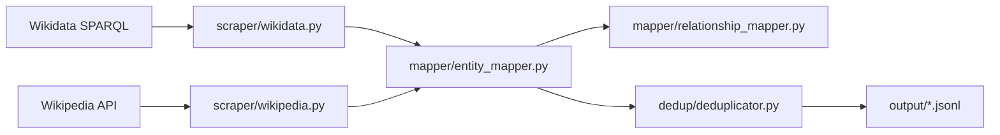

# Data Pipeline Architecture

> Source directories: `pipeline/` and `api/app/Console/Commands/`

## Overview

The current data pipeline is split into two Python tracks plus a Laravel import layer:

1. `pipeline/wikidata/` for generic Wikidata/Wikipedia scraping, topic graph walks, and deduplication.
2. `pipeline/ohm_borders/` for staged OpenHistoricalMap borders processing and relation extraction.
3. Laravel artisan commands for importing generated artifacts, resolving relationship hints, and generating embeddings.

The system is intentionally file-based. Python writes JSONL and staged artifacts to disk first, then Laravel imports those artifacts later. This keeps the scrape and import loops decoupled and repeatable.

## Working Directory and Output Rules

- Run `py -m pipeline ...` from the repository root.
- `pipeline/.env` currently sets `OUTPUT_DIR=output`.
- In the default repo workflow, that means artifacts are written to the repository-level `output/` directory.
- The top-level `python -m pipeline` entry point does not work from inside the `pipeline/` directory unless you adjust `PYTHONPATH` yourself.
- `--output-dir` and `--artifact-dir` can override the default paths when needed.

## Current Module Layout

```text
pipeline/
├── __main__.py              # Unified CLI dispatcher
├── config.py                # Settings, env loading, entity groups
├── tests/                   # Python verification suite
├── wikidata/
│   ├── __main__.py          # scrape / topic / dedup commands
│   ├── dedup/
│   ├── embeddings/
│   ├── mapper/
│   ├── queries/
│   ├── resolver/
│   └── scraper/
└── ohm_borders/
    ├── __main__.py
    ├── artifacts.py
    ├── enricher.py
    ├── fetcher.py
    ├── index_builder.py
    ├── index_store.py
    ├── stage_*.py
    ├── stages.py
    └── subgraph_extractor.py
```

## 1. Wikidata Pipeline

### Commands

| Command | Purpose |
|---------|---------|
| `py -m pipeline scrape` | Scrape entities by type or group |
| `py -m pipeline topic` | BFS graph-walk from a named entity or Wikidata QID |
| `py -m pipeline dedup` | Deduplicate an existing JSONL file, optionally against the database |

### Flow



### Output buckets

Common outputs include:

- `output/<entity_type>.jsonl`
- `output/topic_<slug>.jsonl`
- `output/topic_<slug>_ref.jsonl`
- `output/topic_<slug>_untyped.jsonl`

Reference-table and untyped topic files are intentionally separated so Laravel can skip them during the normal `pipeline:import --all` workflow.

### Important implementation pieces

- `scraper/wikidata.py`: batched SPARQL queries and property enrichment.
- `scraper/wikipedia.py`: summary extraction and infobox enrichment.
- `scraper/topic.py`: BFS graph walk from a seed entity.
- `mapper/type_configs.py`: entity-type mapping and field configuration.
- `mapper/relationship_mapper.py`: relationship-hint extraction.
- `dedup/deduplicator.py`: QID, fuzzy-name, and optional DB-backed deduplication.
- `resolver/geo_resolver.py`: OHM-oriented geo-resolution helpers used during scrape workflows.

## 2. OHM Borders Pipeline

The OHM pipeline is staged and resumable. Each run is keyed by a `run_id` and writes a structured artifact tree under `output/ohm_borders/<run_id>/`.

### Core commands

| Command | Purpose |
|---------|---------|
| `borders build-index` | Build or refresh a reusable SQLite index for a raw OHM payload |
| `borders extract-subgraph` | Derive a seed-centered OHM subgraph from an indexed global payload |
| `borders fetch` | Download the Overpass payload and shard raw relations |
| `borders parse` | Parse raw shards into polity records |
| `borders enrich` | Attach Wikidata and Wikipedia metadata |
| `borders build` | Map enriched records into importer-ready entity JSONL |
| `borders run` | Run fetch, parse, enrich, and build together |
| `borders relations-scan` | Extract predecessor, successor, and event candidates |
| `borders relations-enrich` | Enrich relation targets |
| `borders relations-build` | Emit importer-ready relation entity and hint files |
| `borders relations-run` | Run the full relation pipeline |

### Artifact layout

```text
output/ohm_borders/<run_id>/
├── manifest.json
├── raw/
├── parsed/
├── enriched/
├── built/
├── final/
│   └── ohm_borders.jsonl
├── relations_candidates/
├── relations_enriched/
├── relations_built/
├── relations_final/
│   ├── ohm_relation_entities.jsonl
│   └── ohm_relation_hints.jsonl
└── subgraph/
    ├── seed.json
    ├── graph_edges.jsonl
    └── closure_report.json
```

### Typical OHM run order

```powershell
py -m pipeline borders run --run-id global-2026-04-15 --parse-workers 8 --enrich-names
py -m pipeline borders relations-run --run-id global-2026-04-15 --resume
```

For subset runs based on a global dump:

```powershell
py -m pipeline borders build-index --input output/ohm_borders/global-2026-04-14/raw/overpass.json
py -m pipeline borders extract-subgraph --input output/ohm_borders/global-2026-04-14/raw/overpass.json --seed-name "Roman Empire" --run-id roman-empire-subgraph --resume
py -m pipeline borders parse --run-id roman-empire-subgraph --resume
py -m pipeline borders enrich --run-id roman-empire-subgraph --resume --enrich-names
py -m pipeline borders build --run-id roman-empire-subgraph --resume
py -m pipeline borders relations-run --run-id roman-empire-subgraph --resume
```

## 3. Laravel Import Layer

The Laravel app consumes pipeline artifacts through artisan commands under `api/app/Console/Commands/`.

| Command | Input | Purpose |
|---------|-------|---------|
| `pipeline:import` | JSONL file or directory | Import generic Wikidata/topic records |
| `pipeline:import-borders` | `final/ohm_borders.jsonl` | Import OHM country/entity records |
| `pipeline:import-border-relations` | `relations_final/` directory | Import OHM relation entities and stage hints |
| `pipeline:embeddings` | Database rows | Generate or refresh pgvector embeddings |

### Important command behavior

- `pipeline:import` supports `--all`, `--sync`, `--force`, `--skip-dedup`, `--skip-relationships`, `--batch-id`, and `--chunk`.
- `pipeline:import-borders` supports `--sync`, `--force`, and `--batch-id`.
- `pipeline:import-border-relations` supports `--sync`, `--force`, `--skip-resolve`, and `--batch-id`.
- `pipeline:embeddings` supports `--pending`, `--all`, `--type`, `--group`, `--reembed`, `--model`, `--chunk`, and `--sync`.

## 4. End-to-End Workflows

### Generic Wikidata/topic import

```powershell
py -m pipeline topic "Late Bronze Age Collapse"

docker compose -f docker/docker-compose.yml exec app `
  php artisan pipeline:import /var/www/html/output/topic_late_bronze_age_collapse.jsonl --sync

docker compose -f docker/docker-compose.yml exec app `
  php artisan pipeline:embeddings --pending --sync
```

### OHM borders import

```powershell
py -m pipeline borders run --run-id global-2026-04-15 --parse-workers 8 --enrich-names

docker compose -f docker/docker-compose.yml exec app `
  php -d memory_limit=1024M artisan pipeline:import-borders `
  /var/www/html/output/ohm_borders/global-2026-04-15/final/ohm_borders.jsonl `
  --sync --batch-id=global-2026-04-15

py -m pipeline borders relations-run --run-id global-2026-04-15 --resume

docker compose -f docker/docker-compose.yml exec app `
  php -d memory_limit=1024M artisan pipeline:import-border-relations `
  /var/www/html/output/ohm_borders/global-2026-04-15/relations_final `
  --sync --batch-id=global-2026-04-15
```

## 5. Operational Notes

- `shapely` must be available in the active Python interpreter for accurate OHM polygon assembly.
- Country subgraph extraction should read Overpass JSON with `utf-8-sig`; Windows-created fixtures may include a BOM.
- `DATABASE_URL` is required for DB-backed dedup checks.
- For Python-side verification, prefer:

```powershell
py -m pytest pipeline/tests
```

- The pipeline remains file-based by design: artifacts are durable checkpoints and can be re-imported without re-scraping.

## Related Docs

- [../../pipeline/README.md](../../pipeline/README.md)
- [../../pipeline/wikidata/README.md](../../pipeline/wikidata/README.md)
- [../../pipeline/ohm_borders/README.md](../../pipeline/ohm_borders/README.md)
- [ohm_country_subgraph_runbook.md](ohm_country_subgraph_runbook.md)